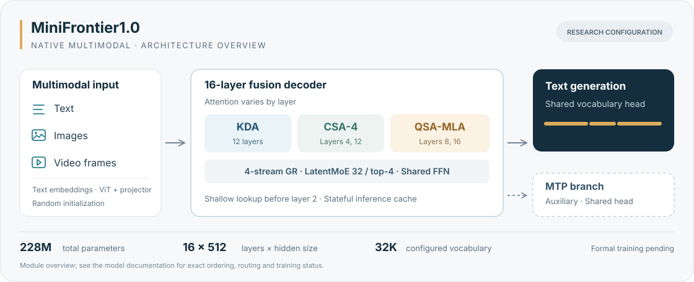

<div align="center">


### 从旗舰架构出发，在小模型上动手。

**读懂架构 · 从零训练 · 探索多模态**

<p>
  <a href="docs/releases/v0.1.0.md"></a>
  <a href="pyproject.toml"></a>
  <a href="pyproject.toml"></a>
  <a href="THIRD_PARTY_NOTICES.md"></a>
  <a href="CONTRIBUTING.md"></a>
</p>

[快速开始](#快速开始) · [模型家族](#模型家族) · [实验与路线图](#实验与路线图) · [文档](docs/README.md) · [参与开发](CONTRIBUTING.md)

</div>

---

**MiniFrontier 把前沿大模型的架构，变成可以阅读、修改和训练的小模型。** 我们借鉴 MiniMind / MiniMind-V 的教学思路，从 Kimi、Qwen、DeepSeek 的公开源码与技术资料出发，探索普通开发者也能参与的大模型训练实践。

主线模型 **MiniFrontier1.0** 将三类架构中的设计组合成一个约 **228M** 参数的原生多模态模型；MiniQwen4、MiniKimi-K3、MiniDeepSeek-V4 保留为独立实现，方便理解各自设计并开展对照实验。

|  阅读与改造 |  训练与复现 |  文本与视觉 |
|:---|:---|:---|
| 对照固定版本的上游源码，理解注意力、MoE、缓存与 MTP 的实现。 | 从数据生成开始，亲手跑通训练、断点恢复、评估和生成。 | 在同一模型中接入文字、图片和视频帧，检查模型是否使用了视觉信息。 |

> [!NOTE]
> 当前为 **v0.1.0 研究预览**：已提供可运行代码、CPU 微型示例和实验记录，尚未发布可用的聊天权重。项目以单张 RTX 3090 上的训练实践为目标，MF1 完整配置的 3090 性能测试和正式训练仍在计划中。

## 快速开始

先在 CPU 上跑通一次完整流程。需要 **Python 3.11+** 和 **[uv](https://docs.astral.sh/uv/getting-started/installation/)**；安装依赖后，示例会在本地生成数据，无需下载训练语料或模型权重。

**1. 安装项目**

```bash
git clone https://github.com/576469377/MiniFrontier.git
cd MiniFrontier
uv sync --locked --extra dev
uv run minifrontier models
```

**2. 生成数据，训练并验证恢复流程**

```bash
CUDA_VISIBLE_DEVICES='' OMP_NUM_THREADS=2 MINIFRONTIER_MIN_FREE_GIB=1 \
  uv run minifrontier mf1 quickstart --device cpu --output outputs/mf1-quickstart
```

示例使用约 **132K 参数**的小配置，生成算术、色块图片和视频帧样本，依次执行短程训练、暂停恢复、索引器训练、稀疏注意力续训和监督微调，并保存检查点与验证记录。该示例用于验证操作流程；步数很少，生成结果可能为空或错误。

**3. 加载刚训练的权重**

```bash
uv run minifrontier mf1 generate \
  --checkpoint outputs/mf1-quickstart/sft/checkpoint.pt \
  --prompt 'Color?' --image outputs/mf1-quickstart/data/media/train-32-0.png \
  --max-new-tokens 12 --temperature 0 --device cpu
```

<details>
<summary><b>在浏览器里查看这个实验</b></summary>

```bash
uv run minifrontier mf1 export \
  --checkpoint outputs/mf1-quickstart/sft/checkpoint.pt --output outputs/mf1-export
uv run minifrontier mf1 demo --checkpoint outputs/mf1-export/model.pt \
  --device cpu --port 7861 --allow-unqualified
```

打开 <http://127.0.0.1:7861>，可输入文字、上传图片或采样视频帧。`--allow-unqualified` 显式启用实验模式，页面会标明权重状态。这个微型示例没有经过聊天能力验收。

</details>

| 接下来想做什么？ | 入口 |
|:---|:---|
| 用自己的数据训练 MiniFrontier1.0 | [数据格式与训练命令](docs/guides/minifrontier1.md) |
| 在 CPU / 单张 3090 上运行三个来源模型 | [最小示例与实测耗时](docs/guides/quickstart.md) |
| 比较不同实验的生成结果 | [实验 Demo](docs/guides/demo-experiments.md) |
| 了解源码安装与 wheel 的支持范围 | [版本说明](docs/releases/v0.1.0.md) |

## 模型家族

**一条融合主线，三条独立架构。** MiniFrontier1.0 从随机初始化开始，组合多种注意力机制、稀疏专家和原生视觉模块；三个来源模型保留各自的结构，作为学习和实验的参照。

<p align="center">
  
</p>

| 模型 | 主要设计 | 研究配置参数量 | 说明 |
|:---|:---|---:|:---|
| **MiniFrontier1.0** | KDA / CSA / QSA-MLA · GR · LatentMoE · ViT · MTP | **228M** | **[融合主线](docs/models/minifrontier1.md)** |
| MiniQwen4 | GDN · GR · PLE · MoE · QSA · 原生视觉 · MTP | 513M | [模型说明](docs/models/miniqwen4.md) |
| MiniKimi-K3 | KDA · MLA · LatentMoE · AttnRes · MoonViT · MTP | 205M | [模型说明](docs/models/minikimik3.md) |
| MiniDeepSeek-V4 | SWA · CSA/HCA · MoE · mHC · 文本 MTP | 244M | [模型说明](docs/models/minideepseekv4.md) |

<details>
<summary><b>参数统计、配置与命名</b></summary>

| 模型 | 精确参数量 | 统计范围 |
|:---|---:|:---|
| MiniFrontier1.0 | 228,235,809 | 主干、视觉模块与 MTP |
| MiniQwen4 | 513,405,536 | 主干、视觉模块与 MTP |
| MiniKimi-K3 | 204,526,216 | 主干、视觉模块与 MTP |
| MiniDeepSeek-V4 | 243,983,472 | 文本主干与 MTP |

表中为各研究配置的总参数量，MoE 的总参数量与单次前向激活参数量不同。微型示例使用更小的配置。

MiniFrontier1.0 的主配置为 **16 层 / hidden 512 / 32K 词表**，主干和视觉编码器均随机初始化。图中为模块概览，具体层序、缓存、lookup 与训练目标见[模型说明](docs/models/minifrontier1.md)。

MiniFrontier1.0 的组合方案由本项目设计；MiniQwen4 的名称来自所参考源码中的 `qwen4_exp` 模块。各模型的来源版本与修改对应关系见[第三方说明](THIRD_PARTY_NOTICES.md)和[MF1 来源映射](configs/minifrontier1/source-map.json)。

</details>

## 实验与路线图

**公开过程，也公开结果。** 实验档案记录配置、命令、随机种子、数据与 tokenizer 校验值、训练量、指标和可重画的曲线。每组实验分别注明完成情况，失败结果也保留在记录中。

| 截至 2026-09-09 | 进展与证据 |
|:---|:---|
| ✅ 架构实现 | 四个模型均有可运行代码；MF1 完整 228M 配置完成 CPU 前后向检查。[实现记录](docs/audits/minifrontier1-implementation.md) |
| ✅ 最小训练流程 | 微型示例跑通数据生成、训练、恢复、评估和生成。[使用指南](docs/guides/minifrontier1.md) |
| 🧪 学习与配方实验 | 三个来源模型开展小规模配方比较；MF1 在合成数据上完成学习实验。[实验档案](docs/experiments.md) |
| ⬜ 正式预训练 | 完成 MF1 数据准备、词表选择、3090 性能测试、架构对照后，推进 **30 亿 token** 主预训练。 |
| ⬜ 后训练与权重发布 | 已有后训练与导出参考实现；正式 SFT、RL、教师蒸馏、草稿训练和能力验收仍待完成。 |

<details>
<summary><b>最近一次 MF1 学习实验，学到了什么？</b></summary>

约 132K 参数的小配置，在 CPU 两线程上训练 600 updates，耗时约 242 秒。留出集上的结果如下：

| 任务 | 原始输入 | 对照输入 |
|:---|:---:|:---:|
| 算术 | 0 / 6 | — |
| 色块图片问答 | 4 / 4 | 图片置黑后 1 / 4 |
| 色块视频问答 | 2 / 2 | 帧置黑后 0 / 2 |

模型使用了色块媒体中的信息，但没有解决留出的算术题；任务简单、样本很少，尚不足以证明通用多模态能力。这是微型配置的学习实验，与完整 228M 模型训练分开记录。

[完整报告与逐步曲线](docs/experiments/mf1-reference-v2/README.md) · [早期三个模型的训练失败复盘](docs/training-failure-v1.md)

</details>

训练按 **数据与词表 → 架构对照 → 多模态预训练 → 索引器与稀疏续训 → SFT → RL / 教师蒸馏 → 草稿与导出** 推进。默认每个任务使用一张卡，多张卡用于独立实验。

主预训练预算为 **30 亿个参与损失计算的 token**，辅助目标及后训练另行统计。详细预算、数据比例和进入条件见[完整方案](docs/training-strategies/2026-09-09/04-MiniFrontier1.0-原生多模态融合架构与全流程实现方案.md)与[阶段配置](configs/minifrontier1)。三个来源模型的路线见[训练指南](docs/guides/training.md)。

## 文档与开发

| 了解项目 | 动手实践 | 核查与复现 |
|:---|:---|:---|
| [文档导航](docs/README.md) | [MF1 全流程指南](docs/guides/minifrontier1.md) | [实验档案](docs/experiments.md) |
| [代码架构](docs/architecture.md) | [CPU / 3090 最小示例](docs/guides/quickstart.md) | [数据来源与处理](docs/guides/data-sources.md) |
| [版本说明](docs/releases/v0.1.0.md) | [后训练实践](docs/guides/posttraining-adaptation.md) | [上游组件与许可](THIRD_PARTY_NOTICES.md) |

<details>
<summary><b>目录结构与开发检查</b></summary>

```text
minifrontier/
├── models/       四个模型的结构实现
├── data/         数据准备、清洗与编码
├── training/     训练、恢复、优化器与后训练
├── evaluation/   生成评测与多模态对照
├── inference/    权重加载、生成、导出与 Demo
└── commands/     命令编排与最小示例
configs/          模型配置与训练配方
scripts/          数据提取、实验调度和分析
tests/            模型、训练和安装测试
docs/             使用指南、模型说明与实验记录
third_party/      固定版本的上游源码及许可
```

本地数据与训练产物分别存放在根目录的 `data/` 和 `outputs/`，不会随源码提交。

```bash
CUDA_VISIBLE_DEVICES='' OMP_NUM_THREADS=2 uv run pytest -q -m 'not cuda'
uv run ruff check .
uv run ruff format --check .
uv run mypy minifrontier scripts --ignore-missing-imports
```

</details>

欢迎改进文档、阅读和实现模型模块，或提交有完整记录的实验。开始前请阅读[贡献指南](CONTRIBUTING.md)，问题与想法可以提交到 [Issues](https://github.com/576469377/MiniFrontier/issues)。

## 数据与许可

MF1 当前示例使用程序生成的算术、色块图像和视频帧，正式训练数据尚未准备完成。三个来源模型的实验使用过 MiniMind、Fineweb-Edu-Chinese、FineWeb-Edu、Python-Edu、UltraChat 及少量 ALLaVA 图文样本。具体版本、处理方法和核查状态见[数据来源说明](docs/guides/data-sources.md)。

本项目原创代码采用 [Apache-2.0](LICENSE)。Qwen 的 Transformers / vLLM 组件保留 Apache-2.0，DeepSeek 组件保留 [MIT](LICENSES/MIT-DeepSeek.txt)，Kimi 组件保留含特定商业使用条件的 [Kimi K3 License](LICENSES/LicenseRef-Kimi-K3.txt)。组件对应关系见[第三方说明](THIRD_PARTY_NOTICES.md)，数据按各自来源条款管理。

---

<div align="center">


感谢 [MiniMind](https://github.com/jingyaogong/minimind)、[MiniMind-V](https://github.com/jingyaogong/minimind-v)，以及 Kimi、Qwen、DeepSeek 等项目公开的源码和研究资料。

**把读过的架构，变成亲手做过的实验。**

</div>
