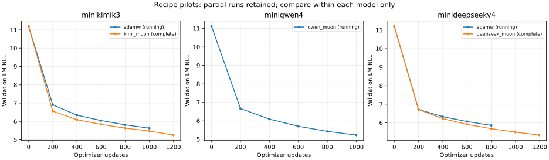

# 实验记录与开源整理

探测实验用于确认可学习性、筛选优化器/学习率/MTP/词表，并测量硬件效率。
正式训练配方、实验过程和失败复盘应随项目整理公开，使读者能够理解选择依据。
本页提供轻量数值档案和整理范围；本地已纳入源码材料，尚未外部上传原始日志、数据或权重。

[2026-09-09 实验快照](experiments/2026-09-09-preview/)含 9 次已启动试验的 JSON、CSV、完整配置/命令/seed/源码与数据 hash、token 账本、性能采样及六组待启动单卡计划。[离线示例实测](experiments/preview-quickstart/)另存 CPU/3090 的六份报告。

## 当前保存了什么

| 文件 | 内容 | 记录粒度或限制 |
|---|---|---|
| `run.json` | 模型配置、优化器、学习率、seed、batch、精度、预算、源码 commit/内容 hash、数据和 tokenizer hash | 对应一次实际运行 |
| `metrics.jsonl` | 训练损失、验证 LM NLL、学习率、梯度范数、有效 token/媒体计数、耗时及部分稳定性事件 | 当前配方通常每10次更新记录训练指标，每200次更新验证；并非每一步都保存全部内部统计 |
| `performance.json` | 50次预热后200次真实更新的时间、数据处理时间、优化器时间、显存和吞吐 | 只适用于所测卡数、长度、batch、模态和实现；不直接外推全部正式阶段 |
| `best-validation.json` | 最佳本地验证结果和对应权重 | 低 NLL 不等于正常对话或视觉泛化能力通过 |
| `status.json` | 已完成步数、实际 CE/input/response/媒体预算与阶段状态 | 运行中周期保存；进度结合最新训练日志读取 |
| `pilot.json`、`queue-plan.json`、`queue.json` | 启动命令、试验依赖、设备安排、失败原因和队列状态 | 区分等待、正在运行、失败与完成 |
| `checkpoint.pt` | 模型、优化器、数据游标、随机状态等恢复信息 | 相同配方下恢复；跨卡数切换不自动视为精确续训 |
| `tensorboard/`、运行日志 | 曲线和执行诊断 | 与 JSONL 并存；单卡新队列有各自的日志目录 |
| 数据 manifest 与来源审计 | 上游版本、采样读取位置、seed、清洗拒绝数、分组切分、tokenizer 和编码校验 | 来源/质量与正式准入仍存在待完成项 |

当前记录目录：

- `outputs/strategy-diagnostics-v2`：小样本可学习性和原生视觉诊断。
- `outputs/strategy-recipe-pilots-v2`：双卡 Muon/AdamW 对照及启动记录。
- `outputs/strategy-single-gpu-v2`：每模型两组单卡学习率试验；排队不等于已经开训。
- `outputs/strategy-source-*`、`outputs/strategy-controllers-v2`：实际训练源码快照和控制器。
- `data/strategy-*`：来源审计、数据构造与编码记录。

这些目录被 `.gitignore` 排除，直接推送代码仓库不会上传其中的日志、数据和权重。
已纳入 Git 的小型诊断与审计材料在 [audits](audits/)，例如：

- [旧训练失败复盘](training-failure-v1.md)。
- [Qwen 首轮算术诊断](audits/qwen-q0-arithmetic-500k.json)及[续诊断](audits/qwen-q0-arithmetic-1m.json)。
- [完整网络 BF16 批量专家梯度对照](audits/grouped-experts-bf16-v2.json)。
- [单卡调度检查和排队快照](audits/single-gpu-scheduling-v2.json)。

审计快照有时间边界，不代替实时进度。实时查看：

```bash
python scripts/training_status.py
```

## 随项目整理公开的材料

1. **实现与执行配方**：固定源码版本、依赖锁、模型配置、实际命令、训练/评估脚本。
2. **数据构造说明**：来源版本、下载/生成入口、采样种子、清洗规则、配比、分组切分和校验值。
3. **轻量实验档案**：每个试验的目标、改变的变量、预算、原始数值指标、可重画的曲线数据和结果摘要。
4. **选择依据与失败复盘**：同时保留有效、无效、失败及未完成的结果；注明训练内记忆与独立泛化评测的区别。
5. **独立模型产物**：验收后的 tokenizer、配置、权重、模型卡和推理示例；大型权重与完整日志单独托管，记录文件 hash 和下载位置。

数据和上游组件按各自条款整理，项目代码许可证不自动覆盖原始数据、图片和模型产物。
许可或来源尚未核清的语料不直接打包；可以先公开构造脚本、来源清单和待解决事项。
来源范围见 [第三方说明](../THIRD_PARTY_NOTICES.md)。发布前需要检查日志中的本机路径、
访问凭据和训练样本内容；实验元数据不能替代原始数据的再分发许可。

## 尚未完成

轻量档案已提供自动导出、汇总与重画入口；完整数据池的独立外部重建、全部消融和补种子试验尚未完成。
现有来源 hash 和执行记录提供追溯依据，不单独证明外部读者已经能够完整复现。
进行中的试验应标为进行中；配方冻结和模型能力验收以后再写最终结论。

公开推送和模型托管发布是单独的发布动作。本页不代表已经执行外部上传。

## 读取、重画与补充快照

```bash
# 在有本地实验记录的 checkout 中，输出到新的带时间目录，避免覆盖旧快照
uv run python scripts/export_experiments.py --workspace "$PWD" \
  --output docs/experiments/YYYY-MM-DD-snapshot
# 绘图依赖独立安装，不加入训练运行时；本次使用 matplotlib 3.10.7
uv run --with matplotlib==3.10.7 python scripts/plot_experiments.py \
  docs/experiments/2026-09-09-preview
```



横轴为 optimizer updates，纵轴为同一模型本地验证集 LM NLL；不同模型的图不作能力排名。运行中的 AdamW/Qwen Muon 曲线保留为 partial，不能拿未完成预算与完成预算直接下结论。CSV 可重画每次 train/validation 记录；JSON 另外保留实际 token 账本和性能采样中的显存、时间。快照时间之后的进展需另导出，不修改旧快照。

Kimi/DeepSeek 的第一组 Muon 已完成 20M CE，对应 AdamW 在该快照时仍运行。Qwen 首轮 Q0 训练内只答对 14/16，续诊断重置优化器并降低 LR 后到 16/16，留出仍为 0/9；因此记录为可学习性通过、泛化未通过。该续诊断的命令和额外 500,450 CE 单独保存，不合并为新一次从零训练。旧 educational-v1 的语言失败继续保留复盘。

配方尚未选定：先在等数据、seed、有效输入 batch 与 CE 预算下比较 Muon/AdamW，再开展已排队的单卡 LR 对照；MTP 权重、32K/64K 词表和补种子仍待完成。没有证据支持直接跳到正式主训练。

档案里的 `${WORKSPACE}` 需要绑定到自己的目录，训练应使用记录的 source commit；命令中的冻结源码目录需要 checkout 对应版本。数据源 revision、采样位置、清洗/切分计数和配方审计随快照提供，原始训练行、图像与权重不随档案发布。既有大试验尚未完成外部逐字节重建验收，hash 是核对依据，不能保证重新下载/训练 tokenizer 必然产生同一文件。无网络、可直接运行的复现范围由最小示例提供。

新快照将工作目录统一为变量，并排除进程、容器和设备 UUID；历史复盘/审计及原始策略保留当时的执行背景，其中的本机目录是历史记录。原始策略正文受 hash 绑定，本次不改写。旧诊断的算术样例来自项目生成器；外部语料样本与媒体不加入新实验档案。

2026-09-09 又增加六组 MTP 共卡对照，具体分配、allocator 上限和原队列接管方式见[共卡实验记录](operations/shared-gpu-experiments.md)。自动导出同时收集原单卡与共卡队列，按输出目录去重，并保留 `co_residency.json` 中的共卡时段；旧快照的时间边界保持不变。
