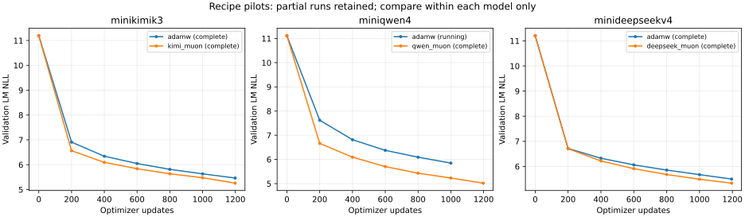

# 三个来源模型的配方实验快照

> 历史快照：本页的“运行中”和候选判断对应下方采集时间。后续已选定[首版工作参数](../2026-09-10-pretraining-cutover/working-recipes.md)；当前不再自动启动联合网格或补种子试验。

采集时间：2026-09-10 07:51:38 UTC。

本快照包含 16 个已启动的 20M CE 配方实验及 4 个早期诊断记录。配方实验中，13 个已完成、3 个仍运行；另有 Qwen 两个学习率实验待启动。原始 JSON/CSV 保留配置、命令、seed、来源校验值、token 账本和曲线。全部属于 acceptance，不计正式主训练预算。

实验分工和目前的选择依据见下方说明；最新验证分数与最新训练 CE 可能来自不同步数，具体比较必须按 JSON 中的验证 step 对齐。

| Experiment | State | CE tokens | Latest validation LM NLL | Measured CE/s |
|---|---|---:|---:|---:|
| [strategy-diagnostics-v2--minideepseekv4](strategy-diagnostics-v2--minideepseekv4.json) ([CSV](strategy-diagnostics-v2--minideepseekv4.csv)) | complete | 500735 | 1.452930539449056 | 163.5091131107459 |
| [strategy-diagnostics-v2--minikimik3](strategy-diagnostics-v2--minikimik3.json) ([CSV](strategy-diagnostics-v2--minikimik3.csv)) | complete | 500450 | 1.1787232716878255 | 135.16564801724988 |
| [strategy-diagnostics-v2--miniqwen4](strategy-diagnostics-v2--miniqwen4.json) ([CSV](strategy-diagnostics-v2--miniqwen4.csv)) | complete | 500450 | 1.1579292233784992 | 55.71579888290027 |
| [strategy-diagnostics-v2--miniqwen4-extension-1m](strategy-diagnostics-v2--miniqwen4-extension-1m.json) ([CSV](strategy-diagnostics-v2--miniqwen4-extension-1m.csv)) | complete | 500450 | 1.254478308359782 | 112.72600286013086 |
| [strategy-recipe-pilots-v2--minideepseekv4--adamw-20m](strategy-recipe-pilots-v2--minideepseekv4--adamw-20m.json) ([CSV](strategy-recipe-pilots-v2--minideepseekv4--adamw-20m.csv)) | complete | 20013084 | 5.498143784134394 | 526.3428746014318 |
| [strategy-recipe-pilots-v2--minideepseekv4--muon-20m](strategy-recipe-pilots-v2--minideepseekv4--muon-20m.json) ([CSV](strategy-recipe-pilots-v2--minideepseekv4--muon-20m.csv)) | complete | 20013084 | 5.334631086140065 | 516.8445481960501 |
| [strategy-recipe-pilots-v2--minikimik3--adamw-20m](strategy-recipe-pilots-v2--minikimik3--adamw-20m.json) ([CSV](strategy-recipe-pilots-v2--minikimik3--adamw-20m.csv)) | complete | 20010912 | 5.463168602161199 | 570.1488719772458 |
| [strategy-recipe-pilots-v2--minikimik3--muon-20m](strategy-recipe-pilots-v2--minikimik3--muon-20m.json) ([CSV](strategy-recipe-pilots-v2--minikimik3--muon-20m.csv)) | complete | 20010912 | 5.25667633755248 | 561.3834668387981 |
| [strategy-recipe-pilots-v2--miniqwen4-after-q0-extension--adamw-20m](strategy-recipe-pilots-v2--miniqwen4-after-q0-extension--adamw-20m.json) ([CSV](strategy-recipe-pilots-v2--miniqwen4-after-q0-extension--adamw-20m.csv)) | running | 19212637 | 5.848418437576233 | 244.4018053020977 |
| [strategy-recipe-pilots-v2--miniqwen4-after-q0-extension--muon-20m](strategy-recipe-pilots-v2--miniqwen4-after-q0-extension--muon-20m.json) ([CSV](strategy-recipe-pilots-v2--miniqwen4-after-q0-extension--muon-20m.csv)) | complete | 20012550 | 5.017851688746724 | 287.222375773371 |
| [strategy-shared-gpu-v2--minideepseekv4--mtp-0](strategy-shared-gpu-v2--minideepseekv4--mtp-0.json) ([CSV](strategy-shared-gpu-v2--minideepseekv4--mtp-0.csv)) | complete | 20013084 | 5.334226843876047 | 503.4105322542753 |
| [strategy-shared-gpu-v2--minideepseekv4--mtp-0.1](strategy-shared-gpu-v2--minideepseekv4--mtp-0.1.json) ([CSV](strategy-shared-gpu-v2--minideepseekv4--mtp-0.1.csv)) | complete | 20013084 | 5.330807047457807 | 466.06439897155093 |
| [strategy-shared-gpu-v2--minikimik3--mtp-0](strategy-shared-gpu-v2--minikimik3--mtp-0.json) ([CSV](strategy-shared-gpu-v2--minikimik3--mtp-0.csv)) | complete | 20010912 | 5.289296183661418 | 548.8928905376886 |
| [strategy-shared-gpu-v2--minikimik3--mtp-0.2](strategy-shared-gpu-v2--minikimik3--mtp-0.2.json) ([CSV](strategy-shared-gpu-v2--minikimik3--mtp-0.2.csv)) | complete | 20010912 | 5.215082979486988 | 508.55441988661386 |
| [strategy-shared-gpu-v2--miniqwen4--mtp-0](strategy-shared-gpu-v2--miniqwen4--mtp-0.json) ([CSV](strategy-shared-gpu-v2--miniqwen4--mtp-0.csv)) | running | 19546239 | 5.260053761240519 | 209.2897203502699 |
| [strategy-shared-gpu-v2--miniqwen4--mtp-0.2](strategy-shared-gpu-v2--miniqwen4--mtp-0.2.json) ([CSV](strategy-shared-gpu-v2--miniqwen4--mtp-0.2.csv)) | running | 18041550 | 5.235745998607435 | 196.8388169293865 |
| [strategy-single-gpu-v2--minideepseekv4--lower-lr](strategy-single-gpu-v2--minideepseekv4--lower-lr.json) ([CSV](strategy-single-gpu-v2--minideepseekv4--lower-lr.csv)) | complete | 20013084 | 6.0565902774399945 | 475.1350875442292 |
| [strategy-single-gpu-v2--minideepseekv4--reference](strategy-single-gpu-v2--minideepseekv4--reference.json) ([CSV](strategy-single-gpu-v2--minideepseekv4--reference.csv)) | complete | 20013084 | 5.333452095412703 | 474.58811979007544 |
| [strategy-single-gpu-v2--minikimik3--lower-lr](strategy-single-gpu-v2--minikimik3--lower-lr.json) ([CSV](strategy-single-gpu-v2--minikimik3--lower-lr.csv)) | complete | 20010912 | 5.080175087209892 | 528.1002065176235 |
| [strategy-single-gpu-v2--minikimik3--reference](strategy-single-gpu-v2--minikimik3--reference.json) ([CSV](strategy-single-gpu-v2--minikimik3--reference.csv)) | complete | 20010912 | 5.256071488071545 | 531.151021157216 |

命令中的 `${WORKSPACE}` 需绑定自己的目录；源码、数据与 tokenizer 按记录的版本和校验值核对。数据需按对应配方准备，本快照只分发数值与元数据。复现说明见[实验索引](../../experiments.md)。

## 当时的选择依据

| 对照 | 已观察到的结果 | 对配方的含义 |
|---|---|---|
| Kimi 优化器 | 等 20M CE，Muon 验证 NLL 5.2567，AdamW 5.4632 | Muon 是较好的候选，仍需补种子验证 |
| DeepSeek 优化器 | 等 20M CE，Muon 5.3346，AdamW 5.4981 | 同样支持保留 Muon 候选 |
| Kimi Muon LR | 0.005 为 5.0802，0.01 为 5.2561 | 当前预算下更低的 LR 更好 |
| DeepSeek LR | 1e-4 为 6.0566，3e-4 为 5.3335 | 这次减小 LR 明显变差 |
| Kimi MTP | 系数 0 为 5.2893，0.2 为 5.2151 | 0.2 值得进入后续联合对照 |
| DeepSeek MTP | 系数 0 为 5.3342，0.1 为 5.3308 | 差异很小，尚不足以作稳定收益结论 |
| Qwen 优化器 | 同第 1000 步：Muon 5.2306，AdamW 5.8484；AdamW 尚未完成预算 | 有候选倾向，等待完整结果 |

同一模型内比较验证 LM NLL，不能横向把四种模型排成能力榜。数据、单/双卡、批次与共卡时段均在每组记录中注明，吞吐不能直接当作独占显卡速度。低学习率和较高 MTP 各自有效，也不等于把两者组合就一定最好；这是当时的研究建议；首版后续采用已选工作参数并开始预训练，未完成的联合对照与补种子保留为局限。

## 可重画曲线



此图展示双卡 Muon/AdamW 对照，运行中的轨迹按实际完成进度绘制。其他 LR/MTP 曲线可从各组 CSV 重画；本次 CSV 同时提供累计 CE 和输入 token，便于按相同预算对齐。生成命令：

```bash
uv run --with matplotlib==3.10.7 python scripts/plot_experiments.py \
  docs/experiments/2026-09-10-recipe-snapshot
```
