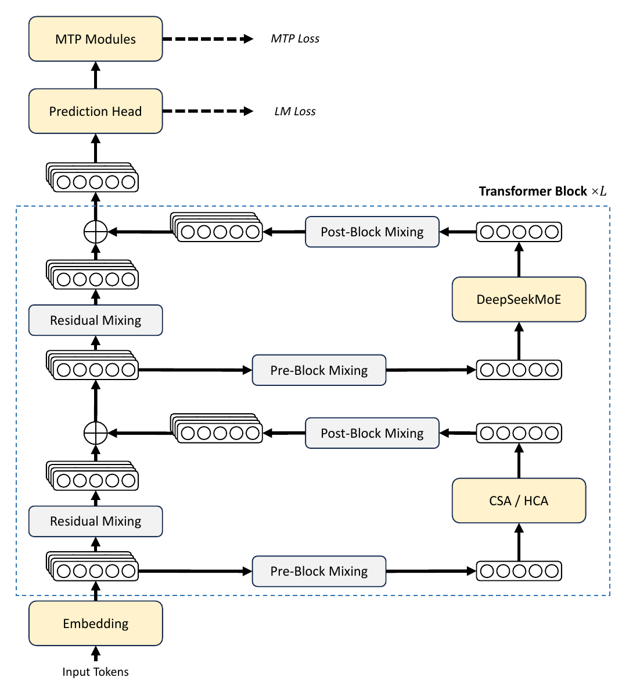
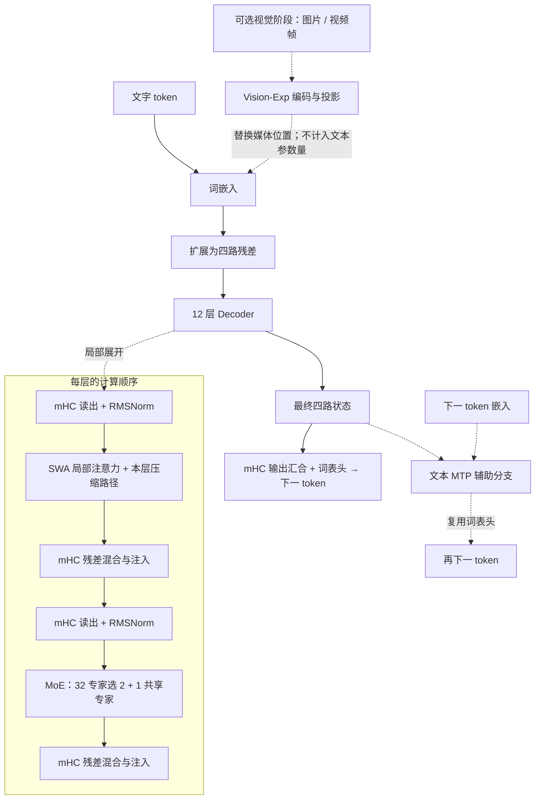

# MiniDeepSeek-V4

**MiniDeepSeek-V4 适合研究局部窗口、历史压缩与多路残差约束。** 它在 SWA 局部注意力之外加入 CSA/HCA 压缩路径，以 mHC 连接四路残差，并在浅层使用 hash routing。当前研究从文本配置起步，视觉接入作为独立阶段管理。

这是基于固定 DeepSeek-V4 源码缩小容量的 v0.1.0 研究预览实现，当前没有通过能力验收的公开聊天权重。固定来源与逐组件许可见[第三方说明](../../THIRD_PARTY_NOTICES.md)，[历史文本版本](../legacy/minideepseekv4-text-v1.md)只保留作演进记录。

[运行示例](../guides/quickstart.md) · [文本研究配置](../../configs/strategies/minideepseekv4-v2.json) · [实现代码](../../minifrontier/models/minideepseekv4/modeling.py) · [固定上游源码](../../third_party/upstream/deepseek-v4-60d8d70)

## 模型结构

### 官方报告结构图



图源：[DeepSeek-V4: Towards Highly Efficient Million-Token Context Intelligence](https://arxiv.org/pdf/2606.19348v1#page=6)，**v1，Figure 2，PDF 第 6 页**，DeepSeek-AI。 原图仅裁去页内正文与空白，图内标签保持原样；版权归原作者，详见[图示来源记录](../assets/upstream/README.md)。

读图时沿输入嵌入向上看：注意力和 DeepSeekMoE 各自通过 mHC 的读出、残差映射和写回连接四路状态；注意力框中交替使用 CSA 与 HCA，顶部附有未来 token 预测分支。该图说明上游文本结构，Mini 的浅层 SWA、压缩比及可选视觉分支在下文明确列出。

### 本仓库的结构与层序



图对应 **243,983,472 个浮点参数的文本配置**；虚线视觉分支仅表示后续可接入的接口。当前 [Vision-v1 配置](../../configs/strategies/minideepseekv4-vision-v1.json)单独定义视觉模块，不能沿用文本参数总数。

| 层号（从 1 开始） | 注意力路径 | 专家路由 |
|---|---|---|
| 1、2 | SWA，窗口 128；不使用压缩分支 | hash routing，32 专家选 2，另有共享专家 |
| 3、5、7、9、11 | SWA + CSA，压缩比 4 | 学习式路由，32 专家选 2，另有共享专家 |
| 4、6、8、10、12 | SWA + HCA，压缩比 128 | 学习式路由，32 专家选 2，另有共享专家 |

| 核心设计 | 可以从这个模型中学习什么 |
|---|---|
| SWA，滑动窗口注意力 | 如何读取最近的 token，并与压缩历史配合 |
| CSA/HCA，历史压缩路径 | 如何在不同压缩比下组织历史 KV，以及保持因果可见性 |
| mHC，流形约束超连接 | 如何用受约束的混合与门控更新四路残差；它与 MF1/Qwen 的 GR 不同 |
| Hash MoE | 如何在前两层按 token 身份路由，并在后续层切换为学习式路由 |
| 文本 MTP / Vision-Exp | 如何分别扩展未来 token 监督与媒体输入，并保持阶段与参数统计清楚 |

### SWA、CSA 与 HCA 如何组合

所有层都保留 **128-token 滑动窗口**来读取近期原始 KV。第 1、2 层只使用窗口；从第 3 层开始，交替加入两种历史压缩路径。查询采用 `512→128→8×64` 的低秩投影，跨头共享的 KV 宽度为 64，其中 16 维参与 RoPE；输出使用 2 组、每组秩 128 的投影返回 512 维。

**CSA（Compressed Sparse Attention）** 将 4-token 块通过可学习门控池化压缩，并采用相邻块重叠方式保留跨块信息。稠密阶段读取所有已完成的可见压缩块，稀疏阶段由独立索引器选择最多 **8 个压缩块**；索引器为 4 头、每头 32 维。主注意力读取的就是压缩后的 KV，不会展开回 4 个原始 token。

**HCA（Heavily Compressed Attention）** 每 128 个 token 形成一个压缩表示，不使用 CSA 的重叠池化或 Top-K 索引器，读取所有已完成的可见高压缩块。因此 HCA 以更粗的表示覆盖更远历史，SWA 提供近期细节。当前序列若不足 128 个 token，尚未形成完整 HCA 块；64-token quickstart 不能覆盖这条长压缩路径。

两种路径均遵守块完成后的因果可见性，并与局部窗口共同归一化注意力。每头还保留可学习的 attention sink 分数，使注意力能够将部分概率分配给不读取内容的槽位。压缩能减少历史表示数，但不能据此把官方百万上下文的性能直接归给本项目 4096 上下文配置。

### mHC：带约束的四路残差混合

mHC（Manifold-Constrained Hyper-Connections）将每个位置扩为四路 512 维状态。每次注意力和 MoE 计算前，输入映射 `pre` 从四流读取子层输入；计算后，用写门 `post` 注入输出，并用 `comb` 混合原有残差：

```text
h = Σ_j pre_j × R_j
u = Sublayer(RMSNorm(h))
R'_i = Σ_j comb_ij × R_j + post_i × u
```

`comb` 是 4×4 非负矩阵，通过配置的 **20 次 Sinkhorn 迭代**约束其行列和，使其接近双随机矩阵；`pre` 和 `post` 分别使用 sigmoid 与两倍 sigmoid 门。这个受约束的残差混合是 mHC 的关键。Qwen/MF1 的 GR 则对归一化后的各路做门控均值，并保留原残差直接写回，不能只因都是“四流”就画成同一个模块。

### MoE：前两层 Hash，后续学习路由

12 层都使用 **32 个路由专家、Top-2 和一个共享专家**，每个 FFN 直接处理 512 维输入，intermediate 为 **256**。前两层根据 token ID 使用固定 hash 表决定专家选择；后续层根据隐藏状态学习路由。它与 Kimi 首层普通 FFN 的安排不同。

Hash 表在当前实现中以不参与梯度更新的整数 Parameter 保存，因此参数清单将其单列。路由分支与共享分支汇合后经 mHC 写回；路由缩放为 1.5，并配置轻量序列平衡目标。激活和路由计算继承固定来源，优化器、损失汇合及训练阶段是本项目的可检查适配。

### 文本 MTP 与独立视觉阶段

当前文本配置包含一个 MTP 模块，利用主干四流状态和下一 token 嵌入进行后续 token 预测，复用输出头，默认辅助系数为 **0.3**。本地 MTP 对每路隐藏状态与下一 token 嵌入做归一化、拼接和 `1024→512` 投影，随后使用一个独立的 SWA／MoE／mHC 块，不带 CSA/HCA 压缩分支。它属于训练辅助目标；DSpark 草稿是后续单独的适应路径，不等同于文本 MTP 已经具备可用的推测解码加速。

官方整体图及本页的 **243,983,472** 参数数值对应文本配置。Vision-Exp 接入另由 [vision-v1 配置](../../configs/strategies/minideepseekv4-vision-v1.json)管理，包括媒体编码、布局和可见性适配；它将增加参数和资源占用。文本预训练、视觉接入和多模态继续训练按阶段记录，不能将图中的可选视觉入口视为已完成的多模态能力。

| 项目 | 本仓库研究配置 | 与官方报告的关系 |
|---|---|---|
| 主干 | 12 层，hidden 512，64K 词表，4096 配置上下文 | 保留窗口与交替压缩结构，缩小容量和上下文 |
| 历史压缩 | CSA 比率 4、Top-8；HCA 比率 128 | 保留压缩 KV 直接参与注意力的机制 |
| 残差 | 4 路 mHC，20 次 Sinkhorn 迭代 | 保留受约束的残差混合 |
| 专家 | 32 选 2 + 一个共享，前 2 层 hash | 采用本项目规模和固定整数路由表 |
| 辅助 / 扩展 | 文本 MTP；视觉配置另列 | 官方整体图不表示本项目视觉阶段已训练完成 |

## 最小运行入口

```bash
CUDA_VISIBLE_DEVICES='' MINIFRONTIER_MIN_FREE_GIB=1 \
  uv run minifrontier quickstart --model minideepseekv4 --device cpu \
  --output outputs/deepseek-quickstart
```

需先按[安装指南](../guides/quickstart.md)安装依赖，每次使用新的输出目录。该命令使用微型文本配置，视觉与 MTP 不在示例中启用；64-token 短序列也不覆盖全部长压缩块路径。

## 当前研究配置

这份文本配置共有 **243,983,472** 个浮点参数，包含 MTP；另有 **262,144** 个固定整数路由项，作为不参与梯度更新的 Parameter 保存。直接对全部 Parameter 求和为 244,245,616，模型清单与首页按浮点参数统计。接入视觉编码器后参数量会增加。根目录的兼容配置与[微型示例](../guides/quickstart.md)采用不同容量。训练默认使用单卡，接入视觉或增加序列长度时需重新测量显存和速度。

## 实现、验证与训练状态

| 状态 | 范围 |
|---|---|
| 已实现 | 文本主干、原生视觉适配、MTP、对应 Muon/路由更新、增量缓存；QAT 仿真和后训练/草稿入口 |
| 已验证 | 非量化专家/Compressor 原始源码对照、mHC、因果性和梯度、索引阶段冻结、Muon/QAT 仿真、增量缓存、原生 Vision-Exp 适配和 DSpark 正确性路径；尚无官方整模型数值 oracle。 |
| 实验 | 已完成部分小样本学习与文本配方比较，首阶段正式训练已启动；完成和停止记录见[实验档案](../experiments.md) |
| 待完成 | 后续预训练阶段、独立能力评估、正式后训练和草稿速度测量 |

截至 2026-09-12，已启动正式首阶段 **D1，文本预训练**，使用冻结词表和数据绑定。完整主预算为 **2.5B 文本 CE**；阶段进度与后续工作统一见[当前实验计划](../experiments/current-plan.md)，参数选择见[工作配方](../experiments/2026-09-10-pretraining-cutover/working-recipes.md)。

计划路线：文本预训练与索引器训练 → 接入 Vision-Exp 视觉编码器 → 多模态继续预训练 → SFT/QAT → 12 个教师模型的全词表反向 KL 蒸馏 → DSpark 草稿模型 → 能力评估。当前文本试验不能作为后续视觉与教师阶段的完成证据。

公开来源未披露的初始化、学习率、损失聚合和容量比例由本项目配置；本地参考后端的速度需单独测量。

## 对照源码阅读

| 阅读目标 | 代码入口 |
|---|---|
| 模型层序与训练阶段 | [modeling.py](../../minifrontier/models/minideepseekv4/modeling.py) |
| SWA、CSA、HCA 与索引目标 | [attention.py](../../minifrontier/models/minideepseekv4/attention.py) |
| mHC 与专家来源定义 | [upstream_layers.py](../../minifrontier/models/minideepseekv4/upstream_layers.py) |
| Sinkhorn 约束 | [kernels.py](../../minifrontier/models/minideepseekv4/kernels.py) |
| Hash／学习式路由适配 | [expert.py](../../minifrontier/models/minideepseekv4/expert.py) |
| 文本 MTP | [mtp.py](../../minifrontier/models/minideepseekv4/mtp.py) |
| 独立视觉接入 | [vision.py](../../minifrontier/models/minideepseekv4/vision.py) |

## 使用与边界

[最小示例](../guides/quickstart.md)覆盖离线数据、PT、暂停恢复、SFT、验证和 CLI 生成；[通用训练指南](../guides/training.md)说明策略门槛和阶段迁移。[原生视觉/MTP与方案审计](../audits/strategy-implementation-v2.md)、[后训练适应](../guides/posttraining-adaptation.md)、[草稿适应](../guides/draft-adaptation.md)记录更细的实现与测试范围。

尚无通过能力评估的公开聊天权重；学习诊断和损失下降不代表已具备对话能力。早期文本训练失败见[复盘](../training-failure-v1.md)。

文本及 Vision-Exp 来源组件保留 [MIT 许可](../../LICENSES/MIT-DeepSeek.txt)。
