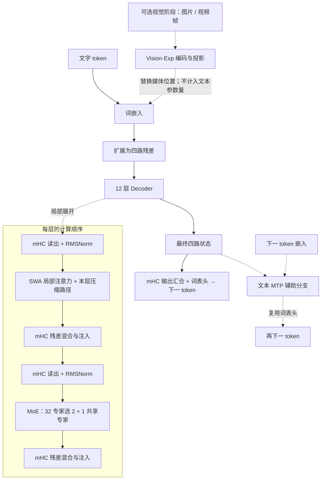

# MiniDeepSeek-V4

MiniDeepSeek-V4 将 DeepSeek-V4 缩小为文本研究模型，采用 SWA 局部注意力、交替 CSA/HCA 历史压缩、四路 mHC 和浅层 hash 路由。Vision-Exp 视觉扩展使用独立配置与训练阶段。

| 研究配置 | 本仓库实现 |
|---|---|
| 参数量 | **244M**（243,983,472 个浮点参数，含文本 MTP） |
| 输入 | 当前配置为文本；[视觉扩展另列](#文本-mtp-与独立视觉阶段) |
| 训练阶段 | 已启动 **D1 文本预训练**；[阶段进度](../pretraining-plan.md) |

模型从随机初始化开始训练，尚无通过能力验收的公开聊天权重。

[运行示例](../guides/quickstart.md) · [文本研究配置](../../configs/strategies/minideepseekv4-v2.json) · [实现代码](../../minifrontier/models/minideepseekv4/modeling.py) · [固定上游源码](../../third_party/upstream/deepseek-v4-60d8d70) · [配置细节](#当前研究配置) · [验证范围](#实现验证与训练状态)

## 模型结构

[层序](#本仓库的结构与层序) · [SWA / CSA / HCA](#swacsa-与-hca-如何组合) · [mHC](#mhc带约束的四路残差混合) · [MoE](#moe前两层-hash后续学习路由) · [MTP / 视觉扩展](#文本-mtp-与独立视觉阶段) · [官方图](#官方报告结构图)

下图按本仓库研究配置绘制：实线为文本主路径，虚线标出独立视觉阶段、Decoder 局部展开和 MTP 辅助分支。官方报告图位于本节末尾，可对照来源结构。

### 本仓库的结构与层序



虚线视觉分支由 [Vision-v1 配置](../../configs/strategies/minideepseekv4-vision-v1.json)单独定义，不计入文本配置的参数总数。

| 层号（从 1 开始） | 注意力路径 | 专家路由 |
|---|---|---|
| 1、2 | SWA，窗口 128 | 固定 hash，32 选 2 + 1 共享 |
| 3、5、7、9、11 | SWA + CSA，压缩比 4 | 学习式路由，32 选 2 + 1 共享 |
| 4、6、8、10、12 | SWA + HCA，压缩比 128 | 学习式路由，32 选 2 + 1 共享 |

### SWA、CSA 与 HCA 如何组合

所有层都以 **128-token 滑动窗口**读取近期原始 KV。查询采用 `512→128→8×64` 低秩投影，跨头共享的 KV 宽度为 64，其中 16 维应用 RoPE；输出使用 2 组、每组秩 128 的投影返回 512 维。

**CSA（Compressed Sparse Attention）** 将 4-token 块做可学习门控池化，并以相邻块重叠保留跨块信息。稠密阶段读取所有已完成的可见压缩块；稀疏阶段由 4 头、每头 32 维的索引器选择最多 **8 个压缩块**。主注意力直接读取压缩 KV。

**HCA（Heavily Compressed Attention）** 每 128 个 token 形成一个压缩表示，读取所有已完成的可见块，不使用重叠池化或 Top-K 索引。它提供较粗的历史表示，近期细节由 SWA 保留。不足 128 token 时没有完整 HCA 块，因此 64-token quickstart 未覆盖这条路径。

两种压缩路径都按块完成时间限制因果可见性，并与局部窗口共同归一化。每头另有可学习的 attention sink 分数，允许将部分概率分配给无内容的槽位。压缩历史缓存随序列增长；本项目上下文上限为 4096，长上下文成本需按实际配置测量。

### mHC：带约束的四路残差混合

mHC（Manifold-Constrained Hyper-Connections）将每个位置扩为四路 512 维状态。输入映射 `pre` 汇合子层输入，写门 `post` 注入计算结果，`comb` 混合原残差：

```text
h = Σ_j pre_j × R_j
u = Sublayer(RMSNorm(h))
R'_i = Σ_j comb_ij × R_j + post_i × u
```

`comb` 是 4×4 非负矩阵，经过 **20 次 Sinkhorn 迭代**，使行列和接近 1；`pre` 使用 sigmoid，`post` 使用两倍 sigmoid。与 Qwen/MF1 的 GR 门控读取、直接写回相比，mHC 额外对四路残差做受约束的混合。

### MoE：前两层 Hash，后续学习路由

12 层均使用 **32 个路由专家、Top-2 和一个共享专家**。每个 FFN 直接处理 512 维输入，intermediate 为 **256**。前两层按 token ID 查固定 hash 表，后续层根据隐藏状态选择专家。

路由分支以 1.5 倍缩放，与共享分支相加后经 mHC 写回；训练另有序列平衡辅助目标。Hash 表以不参与梯度更新的整数 Parameter 保存，参数统计将其单列。

### 文本 MTP 与独立视觉阶段

文本配置包含 **一个 MTP**，默认辅助系数 **0.3**。它将每路主干状态与下一 token 嵌入分别归一化、拼接，经 `1024→512` 投影后进入独立的 SWA / MoE / mHC 块，再复用主输出头预测后续 token。MTP 不含 CSA/HCA 压缩分支；DSpark 是后续单独训练的草稿路径。

[Vision-v1 配置](../../configs/strategies/minideepseekv4-vision-v1.json)增加视觉编码、布局和可见性适配，同时增加参数与资源占用。视觉接入、多模态继续训练和评估独立于本轮文本预训练。

### 官方报告结构图


图源：DeepSeek-AI，[DeepSeek-V4: Towards Highly Efficient Million-Token Context Intelligence](https://arxiv.org/pdf/2606.19348v1#page=6)，v1，Figure 2，PDF 第 6 页。图内内容保持原样，权利归原作者；[提取与来源记录](../assets/upstream/README.md)。

从输入嵌入向上，注意力和 DeepSeekMoE 分别通过 mHC 读取、混合和更新四路状态；注意力框中交替使用 CSA 与 HCA，顶部附有 MTP。原图描述上游文本结构，本仓库的层序与视觉接口见前面的本地结构图。

## 当前研究配置

[文本配置](../../configs/strategies/minideepseekv4-v2.json)另有 **262,144 个固定整数路由项**；全部 Parameter 元素合计 244,245,616。总参数量包含全部专家，每 token 只激活其中一部分；根目录兼容配置和微型示例采用其他容量。

| 项目 | 本仓库配置 | 来源与适配 |
|---|---|---|
| 主干 | 12 层、hidden 512、64K 词表、上下文上限 4096 | 缩小容量，保留局部窗口与交替压缩 |
| 压缩 | CSA 比率 4、Top-8；HCA 比率 128 | 压缩 KV 直接参与注意力 |
| 残差 | 4 路 mHC，20 次 Sinkhorn 迭代 | 保留受约束的混合 |
| 专家 | 32 选 2 + 1 共享，前 2 层 hash | 使用本地专家规模与路由表 |
| 扩展 | 文本 MTP；视觉配置另列 | 分别记录训练与参数量 |

初始化、损失聚合、优化器与学习率由本项目配置；训练适配不包含上游完整训练栈和融合内核。

## 最小运行入口

```bash
CUDA_VISIBLE_DEVICES='' OMP_NUM_THREADS=2 MINIFRONTIER_MIN_FREE_GIB=1 \
  uv run minifrontier quickstart --model minideepseekv4 --device cpu \
  --output outputs/deepseek-quickstart
```

先[安装依赖](../guides/quickstart.md)，每次使用新输出目录。示例为微型文本配置，不启用视觉和 MTP；64-token 序列未覆盖 HCA。

## 实现、验证与训练状态

D1/D2/D4/D5 合计 **2.5B 主 CE**，D3 索引器 input 单独计量。完成文本模型后再推进 Vision-Exp、多模态训练、SFT/QAT、12 教师的全词表反向 KL 蒸馏及 DSpark。阶段进度见[预训练计划](../pretraining-plan.md)，配方依据见[工作参数](../experiments/2026-09-10-pretraining-cutover/working-recipes.md)。

已有检查覆盖非量化专家与 Compressor 来源对照、mHC、因果性和梯度、Muon/QAT 仿真、索引器冻结、缓存、Vision-Exp 和 DSpark，详见[实现审计](../audits/strategy-implementation-v2.md)；尚无官方整模型数值 oracle。完整训练、独立能力评估与草稿速度测量尚未完成。

## 对照源码阅读

| 阅读目标 | 代码入口 |
|---|---|
| 模型层序与训练阶段 | [modeling.py](../../minifrontier/models/minideepseekv4/modeling.py) |
| SWA、CSA、HCA 与索引目标 | [attention.py](../../minifrontier/models/minideepseekv4/attention.py) |
| mHC 与专家来源定义 | [upstream_layers.py](../../minifrontier/models/minideepseekv4/upstream_layers.py) |
| Sinkhorn 约束 | [kernels.py](../../minifrontier/models/minideepseekv4/kernels.py) |
| Hash／学习式路由适配 | [expert.py](../../minifrontier/models/minideepseekv4/expert.py) |
| 文本 MTP | [mtp.py](../../minifrontier/models/minideepseekv4/mtp.py) |
| 独立视觉接入 | [vision.py](../../minifrontier/models/minideepseekv4/vision.py) |

## 使用与边界

[训练与恢复](../guides/training.md) · [后训练](../guides/posttraining-adaptation.md) · [草稿训练与推理](../guides/draft-adaptation.md) · [历史文本版本](../legacy/minideepseekv4-text-v1.md) · [早期失败复盘](../training-failure-v1.md)

文本和 Vision-Exp 来源组件保留 [MIT 许可](../../LICENSES/MIT-DeepSeek.txt)，组件范围见[第三方说明](../../THIRD_PARTY_NOTICES.md)。
