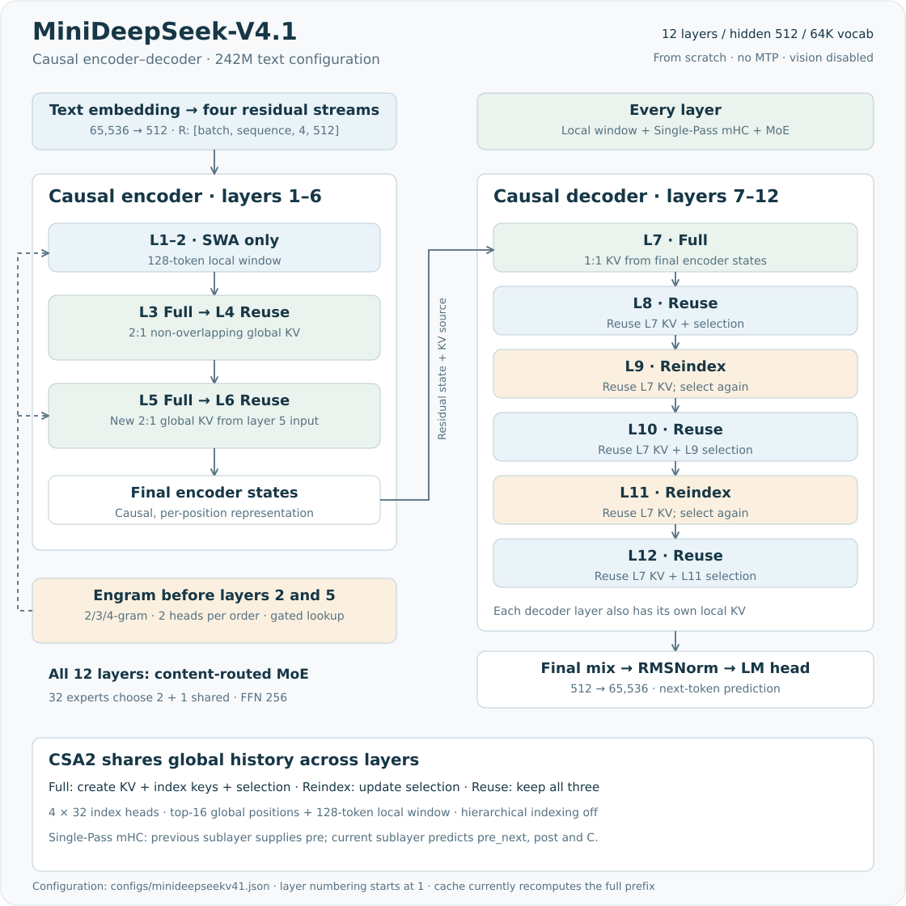

# MiniDeepSeek-V4.1

MiniDeepSeek-V4.1 是按 DeepSeek-V4.1-Flash 公开结构实现的小规模研究模型。它采用因果编码器与解码器分工（CED）、跨层共享的 CSA2 稀疏注意力、Single-Pass mHC 和 Engram 查表记忆，从随机初始化训练。

| 研究配置 | 本仓库实现 |
|---|---|
| 参数量 | **242M**（242,393,544 个浮点参数；默认纯文本配置，无 MTP） |
| 主干 | 12 层、宽度 512、65,536 词表；前 6 层编码，后 6 层解码 |
| 专家 | 每层 32 个路由专家选 2 个，加 1 个共享专家 |
| 上下文 | 配置上限 4096，训练按阶段增加长度 |
| 状态 | 文本预训练已启动，尚无通过独立能力评估的聊天权重 |

[模型配置](../../configs/minideepseekv41.json) · [实现代码](../../minifrontier/models/minideepseekv41/modeling.py) · [训练方案](../training-strategies/2026-09-14/07-v41-mf11-implementation-and-training.md) · [阶段进度](../pretraining-plan.md) · [上游源码与校验记录](../../third_party/upstream/deepseek-v4.1-dba1be0/source.json)

本版本与 [MiniDeepSeek-V4](minideepseekv4.md) 是分别初始化、分别计量的实验。V4 的交替 CSA/HCA、浅层 hash 路由和文本 MTP，并非 V4.1 当前配置的组成部分；两个版本的检查点不能直接互换。

## 模型结构



[下载 SVG](../assets/minideepseekv41-architecture.svg)。图按本仓库默认配置绘制，层号从 **1** 开始。

### CED 与 CSA2 的共享范围

CED 的编码器与解码器均保持因果约束：编码器每个位置只能看到自身及过去。解码器的全局 KV 由**最终编码状态**产生，本层局部窗口仍使用自己的隐藏状态。这里的编码器并非读取完整输入的双向编码器。

CSA2 每层保留最近 **128 token** 的局部窗口，并根据层类型构建或复用全局历史：

| 层号 | 分工 | 全局压缩比 | 模式 | 全局 KV / 索引的来源 |
|---|---|---:|---|---|
| 1、2 | 编码 | — | SWA | 只有本层局部窗口 |
| 3 | 编码 | 2:1 | Full | 从本层输入新建 KV、索引键及选择结果 |
| 4 | 编码 | 2:1 | Reuse | 复用第 3 层的 KV 和选择结果 |
| 5 | 编码 | 2:1 | Full | 从本层输入重新建立全局历史 |
| 6 | 编码 | 2:1 | Reuse | 复用第 5 层的 KV 和选择结果 |
| 7 | 解码 | 1:1 | Full | 从最终编码状态建立全局 KV 和索引键 |
| 8、10、12 | 解码 | 1:1 | Reuse | 使用第 7 层 KV，复用最近一次选择结果 |
| 9、11 | 解码 | 1:1 | Reindex | 使用第 7 层 KV 和索引键，重新选择位置 |

**Full** 新建 KV 和索引键；**Reindex** 只重新计算查询分数与选择结果；**Reuse** 连选择结果也复用。共享发生在一次前向的层间状态中，不代表所有层共用同一套权重，也不等于推理已有高效增量 KV 缓存。

2:1 压缩采用不重叠的两 token 门控池化，只允许已完成、因果可见的块参与注意力。1:1 不合并序列位置，仍投影为全局 KV。索引器使用 **4 个 32 维头**，从可见历史中选择最多 **16 个位置**；局部窗口另计。主注意力为 **8 个 64 维头**，查询低秩 128，KV 跨头共享，16 维使用 RoPE。

分层候选池已有实现开关，默认 `hierarchical_indexing=false`。当前预训练不会使用候选块的二次筛选。查询按 64 个位置分块计算，以限制临时张量大小；共享历史和索引评分的成本仍随序列增长。

### Single-Pass mHC 与专家层

每个 token 维护四路 512 维残差。注意力、MoE 各有一组 mHC，负责输入汇合、残差混合和子层结果注入。Single-Pass 的关键在于：**当前子层产生的输入系数交给下一子层使用**。

```text
pre_next, post, C = coefficients(R)
h                 = RMSNorm(Σ_i pre_in[i] × R[i])
u                 = Attention(h) 或 MoE(h)
R_next[j]         = Σ_i C[i,j] × R[i] + post[j] × u
```

`C` 经过 20 次 Sinkhorn 归一化，使非负混合矩阵的行列和接近 1。系数计算和残差归约使用 FP32；入口先读取第一路，最后使用末层传出的系数汇合状态，再经 RMSNorm 和独立词表头预测下一 token。

全部 12 层都采用内容路由：32 个路由专家选 2 个，加一个始终执行的共享专家，FFN intermediate 为 256。路由分数为 `sqrt(softplus(logit))`，校正偏置决定专家选择，混合权重由原始分数归一化后乘 1.5。默认采用 `batched` 专家执行，并保留序列平衡辅助目标。

### Engram：第 2、5 层前的条件查表

Engram 将文本 token 的归一化 ID 用于 2/3/4-gram 哈希，每种长度各 2 个头。每次注入查询 **6 张表**，表容量取 32,768 附近互不重复的素数，每行 32 维；拼接后的 192 维结果投影为四路 key 和一个共享 value。

各路残差与 key 的归一化匹配分数控制 value 的注入量。查表 ID 映射与哈希参数进入检查点，开始训练前绑定实际 tokenizer。Padding 和图像跨度截断查表历史；图像位置不执行文本查表注入。Engram 是可训练的局部词组记忆，不是外部检索系统。

## 训练安排

主干直接从 `sparse_pretrain` 开始。索引器用选中历史上的注意力概率作为停止梯度的教师，训练本地 KL 目标。它是对公开推理代码的训练适配；上游没有提供可直接复现的完整训练器。

```text
L = L_CE + 1.0 × L_indexer + 0.0001 × L_sequence_balance
```

| 阶段 | 主 CE 预算 | 训练长度 | 注意力 |
|---|---:|---|---|
| D1 | 250M | 512 / 1024 | 稀疏 |
| D2 | 500M | 1024 / 2048 | 稀疏 |
| D3 | 1.5B | 2048 / 4096 | 稀疏 |
| D4 | 250M | 1024 / 2048 / 4096 | 稀疏 |
| **合计** | **2.5B** | | |

主干不含 MTP，也没有 V4 的独立索引器预热阶段。矩阵参数使用 Muon，其中可分离的 Q/K 按头更新；词嵌入、输出头和 Engram 表使用 Sinkhorn 更新，标量等参数使用 AdamW。Engram 表学习率为主学习率的 5 倍。完整学习率、数据配比和恢复约束见[机器可读训练计划](../../configs/strategies/minideepseekv41-plan.json)。

视觉模块的前向、梯度和图像 CE 屏蔽已有测试，但默认配置 `vision_config=null`，当前正式阶段只训练文本。**完整视觉数据编码、文本到视觉迁移和图像推理入口尚待接通**；不能仅设置 `vision_config` 就按现有 CLI 完成视觉接续。[候选视觉阶段](../training-strategies/2026-09-14/07-v41-mf11-implementation-and-training.md#视觉阶段)的数据和预算也需另行绑定。

## 实现验证与限制

[模型测试](../../tests/test_deepseek_v41.py)覆盖 CED 因果性、共享 KV 梯度、Full/Reindex/Reuse、分层候选选择、Engram、图像监督、BF16 反向及缓存一致性；mHC、Compressor 和 Engram 的部分计算与固定上游源码作前向、反向对照。[优化器测试](../../tests/test_v41_optimizer.py)覆盖更新公式、参数归属、非有限梯度拒绝及恢复连续性。

- 推理缓存目前采用**完整前缀重算**：保存输入历史，每步重算前缀并返回新增位置的输出。它用于检查生成一致性，尚无增量 KV 加速。
- 当前实现没有官方部署中的 FP4、Mega-mHC 融合内核或近似有界重放；模块检查不能推导出相同吞吐或整模型等价。
- 文本预训练、视觉接续、独立能力评估和草稿训练分别验收。新增结构尚不能证明相对 V4 的质量或速度提升。

| 阅读目标 | 代码入口 |
|---|---|
| CED 层序、损失与图像接口 | [modeling.py](../../minifrontier/models/minideepseekv41/modeling.py) |
| CSA2 与共享状态 | [deepseek_v41_layers.py](../../minifrontier/models/deepseek_v41_layers.py) |
| Single-Pass mHC | [deepseek_v41_layers.py](../../minifrontier/models/deepseek_v41_layers.py) |
| Token 映射、哈希与门控查表 | [engram.py](../../minifrontier/models/minideepseekv41/engram.py) |
| 完整前缀重算 | [cache.py](../../minifrontier/models/minideepseekv41/cache.py) |
| Muon / Sinkhorn / AdamW 分组 | [v41_optim.py](../../minifrontier/training/v41_optim.py) |

来源组件保留上游 MIT 许可，原创适配遵循本项目许可，详见[第三方说明](../../THIRD_PARTY_NOTICES.md)。
