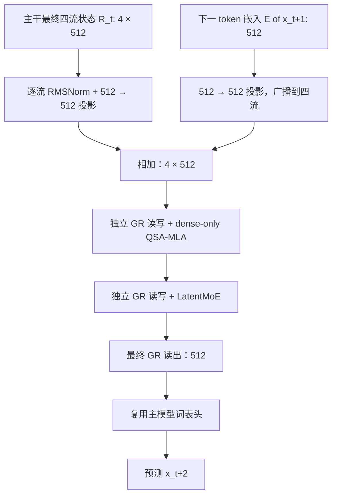

# MiniFrontier1.0

**MiniFrontier1.0（MF1）是本项目设计的原生多模态融合模型。** 它组合递推记忆、压缩注意力和稀疏检索，并自行设计层序、样本边界与训练目标；主干和视觉编码器均随机初始化。

适合希望跑通图文／视频帧训练流程、修改融合架构或开展模块对照实验的读者。当前提供代码与实验记录，尚无通过语言和多模态能力验收的公开权重。模型系列的 `1.0` 与 Python 包的 `0.1.0` 分别表示模型设计版本和软件版本。

[运行最小示例](../guides/minifrontier1.md#离线最小示例) · [228M 配置](../../configs/minifrontier1/model_228m_native.json) · [实现代码](../../minifrontier/models/minifrontier1/modeling.py) · [实验记录](../experiments.md)

## 模型结构

本文按 [228M 原生配置](../../configs/minifrontier1/model_228m_native.json)解释计算过程。图中的层号从 **1** 开始；`B` 为 batch，`T` 为**已经展开媒体占位位置**的序列长度，`D=512` 为主干宽度。微型运行示例采用更小的层数和宽度。

[整体数据流](#整体数据流) · [Decoder 与 GR](#decoder-与-gr) · [三种注意力](#三种注意力如何读取历史) · [专家](#latentmoe-路由与共享分支) · [视觉](#视觉输入与位置编码) · [MTP](#mtp-辅助预测) · [参数与训练](#参数和训练阶段)

### 整体数据流


[下载总体结构 SVG](../assets/minifrontier1-detail.svg)。这是本项目按实现绘制的结构图；实线表示主数据流，虚线表示局部展开、lookup 注入或辅助训练分支。

一次前向计算可以分成四步：

1. 文字经过词嵌入；图像或采样视频帧经过视觉编码器。视觉特征替换对应媒体占位位置的嵌入，得到统一的 `[B,T,512]` 序列。
2. 将每个位置的向量复制为四路残差，得到 `[B,T,4,512]`。它们在入口处相同，随后由每层的门控读写学习不同的更新。
3. 依次经过 16 个 Decoder 层；每层先执行一种注意力，再执行 LatentMoE，两次子层调用各有独立的 GR。第 2 层前额外注入一次局部词组查表特征。
4. 最终只读 GR 将四路状态汇合成 `[B,T,512]`，独立词表头输出 `[B,T,32768]` 的 logits。训练可分块计算词表交叉熵，避免同时保留完整 logits。一个 MTP 模块提供额外的未来 token 监督。

| 层号 | 1–4 | 5–8 | 9–12 | 13–16 |
|---|---|---|---|---|
| 按顺序使用的注意力 | KDA → KDA → KDA → CSA | KDA → KDA → KDA → QSA-MLA | KDA → KDA → KDA → CSA | KDA → KDA → KDA → QSA-MLA |
| 专家模块 | 每层均为 LatentMoE | 每层均为 LatentMoE | 每层均为 LatentMoE | 每层均为 LatentMoE |

这形成 **12 KDA + 2 CSA + 2 QSA-MLA**。设计动机是在多数层用递推记忆处理序列，定期读取压缩历史，并在更深处检索原始细节。是否比单一注意力或其他层序更好，需要对应消融实验验证。

### Decoder 与 GR


[下载单层结构 SVG](../assets/minifrontier1-decoder.svg)。GR（Gated Residual，门控残差）管理的是**层与层之间的信息流**；KDA、CSA 和 QSA-MLA 管理的是**序列位置之间的信息流**。

对某个位置，记四路残差为 `R₁…R₄`，每路 512 维。GR 先对每路做 RMSNorm，将归一化后的四路向量拼接，再用低秩门网络 `2048→64→2048` 计算逐路、逐通道的 sigmoid 读门 `a`。读出的子层输入为：

```text
N_j = RMSNorm(R_j)
h   = (1/4) × Σ_j [a_j ⊙ N_j]        # h: 512；a_j: 512
u   = Attention(h) 或 LatentMoE(h)    # u: 512
R'_j = R_j + β_j × u                 # β_j: 一个标量，范围 (0, 2)
```

写门 `β` 由归一化状态的另一投影计算：`2 × sigmoid(Linear(flatten(N)) / 4)`。读出采用四路**门控均值**，没有对读门做 softmax 归一化。写回使用原来的残差 `R`，而非归一化后的 `N`。注意力和 MoE 各有一套门参数；最终 GR 只读取，不写回。四路状态属于一个模型内部的张量维度，与 GPU 数量无关。

### 三种注意力如何读取历史


[下载注意力对照 SVG](../assets/minifrontier1-attention.svg)。三个模块都接收和返回 512 维向量，但存储和读取历史的方式不同。

| 比较项 | KDA | CSA-4 | QSA-MLA |
|---|---|---|---|
| 出现位置 | 除 4/8/12/16 外的 12 层 | 第 4、12 层 | 第 8、16 层 |
| 历史表示 | 每头一个递推状态矩阵 | 每 4-token 块生成压缩 KV | 每个 token 保存 latent KV，另建压缩块索引 |
| 实际读取对象 | 当前递推状态 | 局部原始 KV + 历史压缩 KV | 所选块中的原始 token KV，以及局部和媒体 token |
| 稠密预训练 | 递推路径不变 | 读取所有因果可见的压缩块 | 读取所有因果可见的原始 token |
| 稀疏继续训练 | 递推路径不变 | 索引器最多选择 64 个压缩块 | 索引器最多选择 64 个块，再展开其原始成员 |
| 解码缓存 | 递推状态和短卷积缓存 | 局部窗口、未完成块、压缩历史 | 完整 latent 历史、位置及块索引 |

**KDA：在状态中记住历史。** Q/K/V 投影后通过宽度为 4 的因果短卷积；门控衰减与 delta 更新控制历史状态的保留和修正。当前查询读取更新后的状态，经过输出门和投影返回主干。配置为 8 头、每头 64 维，因此每层的递推矩阵形状为 `[B,8,64,64]`，不随历史长度增加。训练的激活、分块计算及后端临时内存仍有各自成本，不能由这个状态大小推断全部训练显存。

**CSA：把压缩结果直接当作 KV。** 查询经过 `512→128→8×64` 的低秩投影；局部 KV 为跨头共享的 64 维表示。历史每 4 个 token 构成一块，通过可学习的重叠池化产生一个压缩表示，允许合并相邻同类块的信息，但不跨独立样本、模态或媒体实例。近期 128-token 原始窗口与完成的压缩块共同参与注意力；稀疏阶段只保留索引器选出的压缩块。压缩向量不会再展开成原始 token。边界会刷新不足 4-token 的短块，`complete_at` 记录块何时真正完成，防止查询看到未来信息。

**QSA-MLA：压缩索引用来找位置，latent KV 用来取内容。** 查询低秩为 128；每个历史 token 保存 128 维 KV latent 与 32 维 RoPE key。参与注意力时，latent 扩展为 8 头，每头包含 64 维内容 key 和 64 维 value，query 另含 32 维位置分量，输出再经过 sigmoid 门。索引器使用 4 个 32 维查询头，按 4-token 块建立候选。在稀疏阶段，可见集合为：

```text
(所选至多 64 个块的原始 token ∪ 最近 128 个 token ∪ 可见媒体 token)
∩ 同一个样本的因果可见位置
```

因此 64×4 不是最终注意力 token 数的硬上限。媒体保护保留同一样本内所有已可见媒体位置；处理器和输入校验将每个样本的媒体特征预算限制在配置的 1024 以内。QSA 仍保存全部历史 latent KV，当前参考路径还会临时展开历史 key/value 再 gather 所选位置，展开结果不写入持久缓存；CSA 仍累积压缩历史；它们的缓存并非固定大小。稀疏选择能否带来实际加速，应由具体后端和输入分布的测量决定。

### LatentMoE 路由与共享分支

每层的 MoE 都同时运行一个**潜在空间路由分支**和一个**全宽共享分支**，输入均为 GR 读出的 `h:512`。上面的单层图展开了两条路径。

| 步骤 | 路由分支 | 共享分支 |
|---|---|---|
| 分配计算 | 在完整 512 维输入上计算 32 个 FP32 sigmoid 路由分数，选择 Top-4 | 每个有效 token 都执行 |
| 输入变换 | `512→256` | 保持 512 维 |
| 专家计算 | 32 个候选专家中执行 4 个；每个为 `256→256→256` 的 SiTU FFN | 一个 `512→768→512` 的 SiTU FFN |
| 汇合 | 归一化所选路由分数并加权求和，之后 RMSNorm，再 `256→512` | 直接得到 512 维输出 |
| 输出 | 两分支相加，再由本子层的 GR 写回四路残差 | 同左 |

路由选择使用 `score + correction_bias`，混合权重则来自未加偏置的原始 `score`；偏置用于调整专家选择，不直接改变专家输出权重。这里没有容量溢出后的 token 丢弃，padding 位置不执行专家。SiTU 对 gate 和 up 两支做有界变换；当前实现为 `4·tanh(g/4)·sigmoid(g)` 与 `25·tanh(u/25)` 相乘。该设计继承 Kimi 的稳定专家计算思路，MF1 的 Top-4、共享分支宽度和整体容量由本项目配置。

### 第 2 层前的 n-gram lookup

Lookup 是一次浅层局部特征补充。它对包含当前 token 的 2-gram 和 3-gram 各使用两个 hash，共查 **4 张 `32768×64` 表**；拼接为 256 维后投影到 512 维，与来自当前隐藏状态的 sigmoid 门相乘，再经过宽度 4 的逐通道因果卷积、SiLU 和可训练尺度 `η`（初始化 0.01）。结果等量加到四路残差，随后进入第 2 层。

这条路径只对普通文本 token 生效。独立样本、媒体和控制 token 会重置 n-gram 与卷积历史；不足长度的 n-gram 贡献为零，不虚构 padding 前缀。它与 Qwen PLE 有设计关联，但表维度、边界规则和注入实现是 MF1 的本地适配，不应将两者配置混写。

### 视觉输入与位置编码

视觉编码器与语言主干一起随机初始化。当前实现处理 RGB 图像和采样视频帧，不包含音频编码器。

| 流程 | 形状或配置 | 作用 |
|---|---|---|
| 预处理 | 保持宽高比并对齐 patch/merge 尺寸；受特征数预算约束 | 确定媒体实际占用多少序列位置 |
| Conv3D patch embedding | 核与步长 `(时间 2, 高 16, 宽 16)`，输出 384 维 | 将像素组变成视觉 patch token |
| ViT | 12 层，宽度 384、6 个头、FFN 1536 | 在视觉编码器内部提取特征 |
| 空间合并 | 每 2×2 个 patch 合并，`4×384=1536` | 将视觉 token 数减少为原来的四分之一 |
| 投影 | `1536→512→512`，中间 GELU | 对齐语言主干宽度 |
| 序列替换 | 每个特征替换一个媒体占位位置 | 与文字一起进入四流 Decoder |

若预处理后的单张图片为 **224×224**，patch 网格为 14×14，合并后为 **49 个视觉 token**；448×448 则为 28×28 → **196 个视觉 token**。这些是指定处理后尺寸的示例，实际数量取决于缩放、裁剪与视频帧数。设 patch 网格为 `(N_t,N_h,N_w)`，输出特征数为 `N_t×N_h×N_w/4`。文档图像入口还支持全局缩略图和源图局部裁剪，细节见[处理代码](../../minifrontier/models/minifrontier1/processing.py)。

QSA-MLA 使用时间／高度／宽度三轴位置，32 维 RoPE 分成 **8/12/12** 维（配置 `[4,6,6]` 按频率对计数）。CSA 与索引器使用各自的线性序列位置和 16 维 RoPE，KDA 通过递推顺序处理位置。媒体位置本身不计算文本 CE；与媒体相关的回答文本才提供语言监督。所有注意力、压缩、lookup 和 MTP 都需要遵守同一份样本边界元数据。

### MTP 辅助预测

MF1 当前只有 **一个** MTP（Multi-Token Prediction）模块。主分支用位置 `t` 的最终状态预测 `x[t+1]`；MTP 再接收真实的 `x[t+1]` 嵌入，预测 `x[t+2]`。



MTP 的 QSA-MLA 固定使用稠密因果注意力，不带索引器；其中的注意力、专家和 GR 有自己的参数，词嵌入及词表输出头与主分支共享。用于预测的当前、下一和再下一位置必须属于同一样本；两个未来位置必须有合法文本监督，不能跨媒体或控制边界。下一 token 不能是 EOS，但再下一预测目标可以是 EOS。

这种使用真实下一 token 的辅助训练并不自动产生可用的多步草稿。草稿适应使用自身生成的前缀，另行训练和验收；主模型的生成也不会仅因打开 MTP loss 就自动加速，见[草稿适应指南](../guides/draft-adaptation.md)。

### 参数和训练阶段

| 配置 | 当前研究值 |
|---|---|
| 总参数 | **228,235,809**，含视觉和一个 MTP；总参数不等于每 token 激活参数 |
| 主干 / 词表 | 16 层、宽度 512；词表 32768，其中 24 个控制 token；嵌入与输出头不绑权 |
| GR | 4 路；低秩读门 64 |
| 专家 | 32 选 4，latent/intermediate 256；共享 FFN intermediate 768 |
| 局部与索引预算 | 窗口 128、4-token 块、最多 64 个候选块；媒体最多 1024 个特征／样本 |
| 上下文 | 配置上限 8192；实际训练按阶段增加长度，尚无完整 8K 能力与 3090 性能验收 |
| 视觉 | 12 层 ViT384，Conv3D `(2,16,16)`，2×2 合并 |
| MTP | 1 个模块，默认辅助系数 0.1 |

按模块计数如下，便于区分主干、辅助目标与视觉的容量。注意力包含相应索引器，MTP 一栏包含其自己的注意力、专家和 GR，因此与主干行没有重复。

| 参数分组 | 参数量 |
|---|---:|
| 词嵌入 + 独立输出头 | 33,554,432 |
| 16 层注意力 | 19,998,112 |
| 16 层 LatentMoE | 123,998,208 |
| 主干 GR + 最终 GR | 8,980,480 |
| Lookup | 8,783,873 |
| 视觉编码与投影 | 22,934,144 |
| 一个 MTP 模块 | 9,986,560 |
| **合计** | **228,235,809** |

| 代码阶段 | 注意力行为 | 优化目标 |
|---|---|---|
| `dense_pretrain` | KDA 递推；CSA 读取全部可见压缩块；QSA-MLA 读取全部可见 raw KV | 主文本 CE 与启用的 MTP；实际索引器项由阶段实现决定 |
| `dense_distill` | 保持稠密教师注意力，仅索引器参数可训练 | 索引器蒸馏损失，冻结其余参数 |
| `sparse_cpt` | CSA 和 QSA-MLA 启用索引选择，KDA 不变 | 文本 CE + 索引器辅助目标 + MTP |

正常语言训练的损失组合为 `L_CE + 0.01×L_indexer + 0.1×L_MTP`，各项仅在当前阶段和配置启用时计算；索引器蒸馏阶段单独使用 `L_indexer`。正式数据、tokenizer、阶段预算与学习率以[预训练主计划](../pretraining-plan.md)和[工作配方](../experiments/2026-09-10-pretraining-cutover/working-recipes.md)为准。

## 实现、实验与能力状态

已完成 CPU 模块、融合前后向、缓存及恢复测试。完整 228M 配置另在共享 RTX 3090 上完成文本、图像、视频的短程优化器更新检查，峰值 reserved 约 4.20 GiB；该数字来自最多 512 输入 token 的短测量，不能覆盖完整性能矩阵。两组各 500K CE 的机制学习实验已完成，色块媒体依赖检查有改善，基础文字问答仍未通过。语言诊断的早期结果见[实验档案](../experiments/mf1-language-performance-v1/README.md)；后续性能优化、正确性修复及测量条件见[执行性能报告](../audits/minifrontier1-execution-performance.md)。

截至 2026-09-12，已启动 **P0 首阶段图文联合预训练**，使用冻结的 32K tokenizer 和正式组件编码；完整主预算为 3B CE。阶段进度与后续数据准备见[当前实验计划](../experiments/current-plan.md)。基础语言、OCR、视频和工具能力仍需独立评估；目前没有公开聊天权重，也没有优于三个来源模型的对照结论。已完成检查与限制见[实现记录](../audits/minifrontier1-implementation.md)。

## 源码与来源

| 阅读目标 | 代码入口 |
|---|---|
| 输入汇合、16 层调度、lookup 注入和最终输出 | [modeling.py](../../minifrontier/models/minifrontier1/modeling.py) |
| 三种注意力与各自的历史状态 | [kda.py](../../minifrontier/models/minifrontier1/kda.py)、[csa.py](../../minifrontier/models/minifrontier1/csa.py)、[qsa_mla.py](../../minifrontier/models/minifrontier1/qsa_mla.py) |
| 四路残差读写与专家路由 | [residual.py](../../minifrontier/models/minifrontier1/residual.py)、[moe.py](../../minifrontier/models/minifrontier1/moe.py) |
| 视觉编码、浅层查表与辅助预测 | [vision.py](../../minifrontier/models/minifrontier1/vision.py)、[lookup.py](../../minifrontier/models/minifrontier1/lookup.py)、[mtp.py](../../minifrontier/models/minifrontier1/mtp.py) |

各模块的来源版本和校验值见[来源映射](../../configs/minifrontier1/source-map.json)。本项目原创部分采用 Apache-2.0，使用的 Kimi、Qwen 和 DeepSeek 组件分别保留上游许可，详见[第三方说明](../../THIRD_PARTY_NOTICES.md)。
