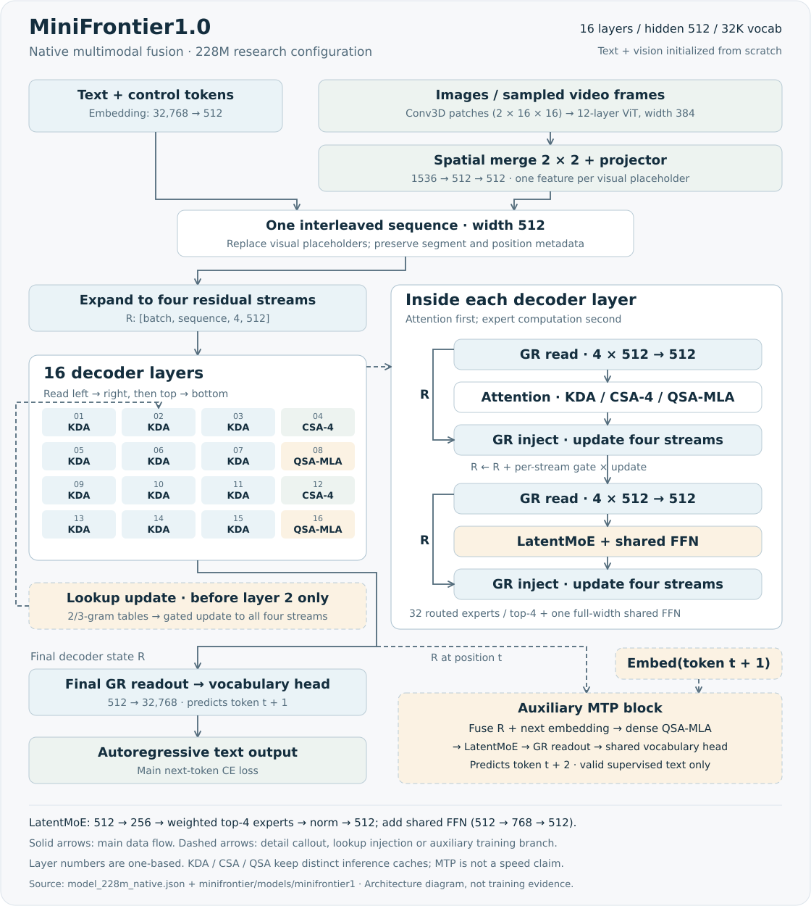
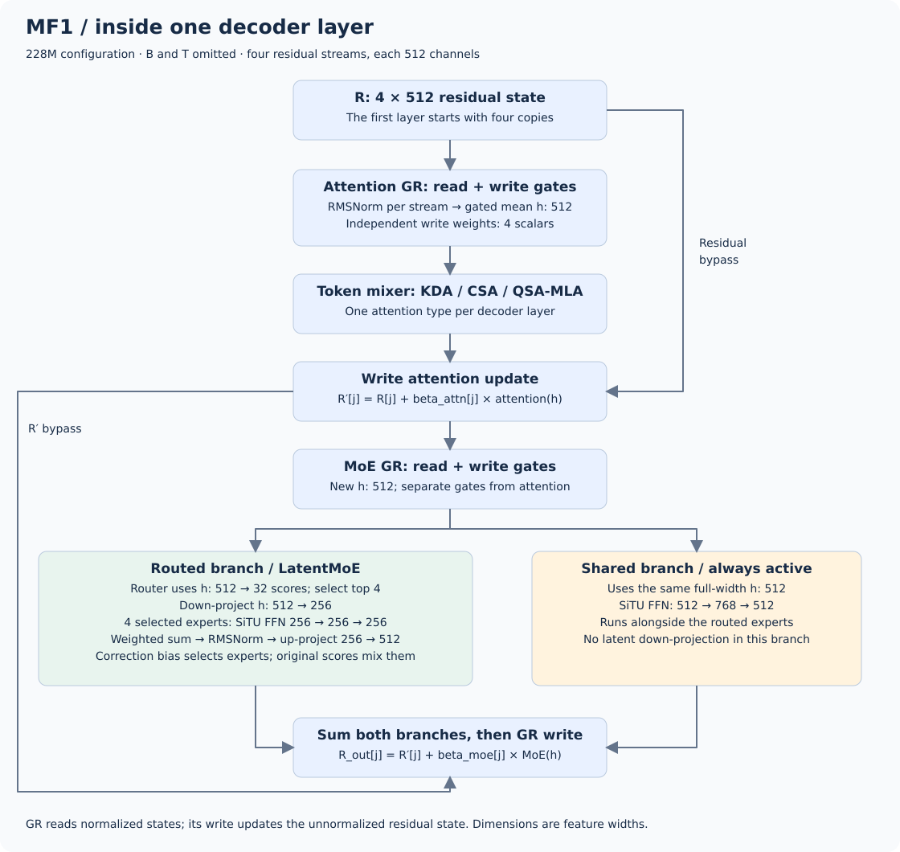
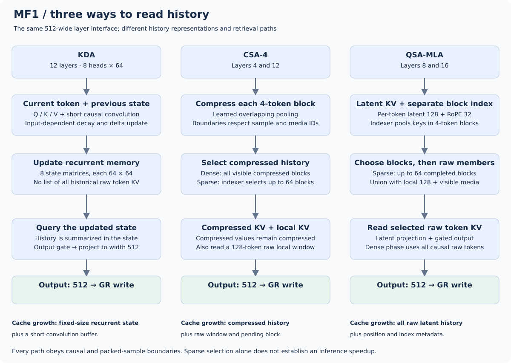
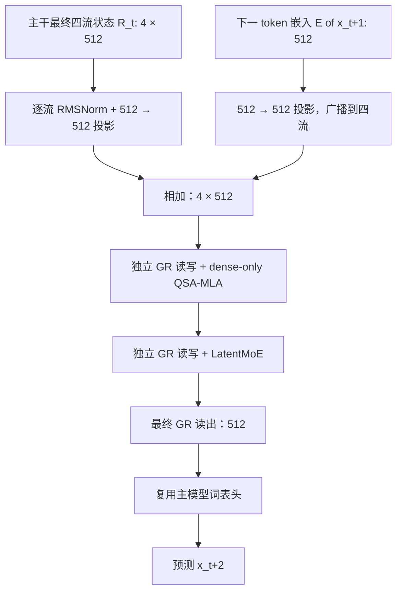

# MiniFrontier1.0

MiniFrontier1.0（MF1）是本项目设计的原生多模态模型：以 KDA 累积递推记忆，CSA 压缩历史，QSA-MLA 检索原始细节，通过四路 GR 和 LatentMoE 组织计算。

| 研究配置 | 本仓库实现 |
|---|---|
| 参数量 | **228M**（228,235,809，含视觉和一个 MTP） |
| 输入 | 文本、图像、采样视频帧；不包含音频 |
| 训练阶段 | 已启动 **P0 图文联合预训练**；[阶段进度](../pretraining-plan.md) |

主干与视觉编码器均从随机初始化训练，尚无通过能力验收的公开聊天权重。

[运行最小示例](../guides/minifrontier1.md#离线最小示例) · [228M 配置](../../configs/minifrontier1/model_228m_native.json) · [实现代码](../../minifrontier/models/minifrontier1/modeling.py) · [实验记录](../experiments.md) · [参数明细](#参数和训练阶段) · [验证范围](#实现实验与能力状态)

模型系列的 `1.0` 与 Python 包的 `0.1.0` 分别表示模型设计版本和软件版本。

## 模型结构

以下按 [228M 原生配置](../../configs/minifrontier1/model_228m_native.json)说明计算。层号从 **1** 开始；`B` 为 batch，`T` 为展开媒体占位后的序列长度，主干宽度 `D=512`。微型示例采用较小容量。

[整体数据流](#整体数据流) · [Decoder / GR](#decoder-与-gr) · [三种注意力](#三种注意力如何读取历史) · [LatentMoE](#latentmoe-路由与共享分支) · [Lookup](#第-2-层前的-n-gram-lookup) · [视觉](#视觉输入与位置编码) · [MTP](#mtp-辅助预测)

三张结构图依次展示整体数据流、单层读写和历史读取方式；MTP 单独列出辅助分支。每张 SVG 均可打开或下载查看细节。

### 整体数据流



[下载 SVG](../assets/minifrontier1-detail.svg)。实线为主数据流，虚线为局部展开、lookup 注入或辅助分支。

1. 文字经过词嵌入；图像或采样视频帧经过视觉编码器。视觉特征替换对应媒体占位位置的嵌入，得到统一的 `[B,T,512]` 序列。
2. 将每个位置的向量复制为四路残差，得到 `[B,T,4,512]`。它们在入口处相同，随后由每层的门控读写学习不同的更新。
3. 依次经过 16 个 Decoder 层；每层先执行一种注意力，再执行 LatentMoE，两次子层调用各有独立的 GR。第 2 层前额外注入一次局部词组查表特征。
4. 最终只读 GR 汇合成 `[B,T,512]`，独立词表头输出 `[B,T,32768]` 的 logits；训练可分块计算交叉熵。MTP 分支提供未来 token 的辅助监督。

| 层号 | 1–4 | 5–8 | 9–12 | 13–16 |
|---|---|---|---|---|
| 按顺序使用的注意力 | KDA → KDA → KDA → CSA | KDA → KDA → KDA → QSA-MLA | KDA → KDA → KDA → CSA | KDA → KDA → KDA → QSA-MLA |

主干共 **12 KDA + 2 CSA + 2 QSA-MLA**，每层都有 LatentMoE。多数层累积递推记忆，间隔读取压缩历史和原始细节；不同层序的效果仍需消融比较。

### Decoder 与 GR



[下载 SVG](../assets/minifrontier1-decoder.svg)。GR（Gated Residual，门控残差）负责子层间的状态读写；注意力负责序列位置间的信息交换。

对某个位置，记四路残差为 `R₁…R₄`，每路 512 维。GR 先对每路做 RMSNorm，将归一化后的四路向量拼接，再用低秩门网络 `2048→64→2048` 计算逐路、逐通道的 sigmoid 读门 `a`。读出的子层输入为：

```text
N_j = RMSNorm(R_j)
h   = (1/4) × Σ_j [a_j ⊙ N_j]        # h: 512；a_j: 512
u   = Attention(h) 或 LatentMoE(h)    # u: 512
R'_j = R_j + β_j × u                 # β_j: 一个标量，范围 (0, 2)
```

写门为 `β = 2 × sigmoid(Linear(flatten(N)) / 4)`。读出取四路门控均值，读门不做 softmax；更新加回原残差 `R`。注意力与 MoE 各有独立的 GR，最终 GR 只读取。四路是模型内部的张量维度，与 GPU 数量无关。

### 三种注意力如何读取历史



[下载 SVG](../assets/minifrontier1-attention.svg)。三种注意力的输入、输出均为 512 维，历史表示与读取方式如下。

| 比较项 | KDA | CSA-4 | QSA-MLA |
|---|---|---|---|
| 出现位置 | 除 4/8/12/16 外的 12 层 | 第 4、12 层 | 第 8、16 层 |
| 历史表示 | 每头一个递推状态矩阵 | 每 4-token 块生成压缩 KV | 每个 token 保存 latent KV，另建压缩块索引 |
| 实际读取对象 | 当前递推状态 | 局部原始 KV + 历史压缩 KV | 所选块中的原始 token KV，以及局部和媒体 token |
| 稠密预训练 | 递推路径不变 | 读取所有因果可见的压缩块 | 读取所有因果可见的原始 token |
| 稀疏继续训练 | 递推路径不变 | 索引器最多选择 64 个压缩块 | 索引器最多选择 64 个块，再展开其原始成员 |
| 解码缓存 | 递推状态和短卷积缓存 | 局部窗口、未完成块、压缩历史 | 完整 latent 历史、位置及块索引 |

**KDA** 将 Q/K/V 投影送入宽度 4 的因果短卷积，再以门控衰减和 delta 更新维护历史状态。查询读取更新后的状态，经输出门与投影返回主干。配置为 8 头、每头 64 维，每层递推矩阵为 `[B,8,64,64]`，不随序列长度增长；训练激活和后端临时内存另计。

**CSA** 的查询采用 `512→128→8×64` 低秩投影，局部 KV 为跨头共享的 64 维表示。每 4 个历史 token 经可学习重叠池化形成一个压缩 KV，相邻块的合并不跨样本、模态或媒体实例。近期 128-token 原始窗口与已完成的压缩块共同参与注意力；稀疏阶段由索引器选择压缩块。边界会刷新不足 4-token 的短块，`complete_at` 限制其因果可见性。

**QSA-MLA** 用块索引选择位置，再读取原始 token 的 latent KV。查询低秩为 128；每个历史 token 保存 128 维 KV latent 和 32 维 RoPE key。计算时扩展为 8 头，每头内容 key/value 各 64 维，query 另有 32 维位置分量，输出带 sigmoid 门。索引器使用 4 个 32 维查询头，按 4-token 块评分；稀疏可见集合为：

```text
(所选至多 64 个块的原始 token ∪ 最近 128 个 token ∪ 可见媒体 token)
∩ 同一个样本的因果可见位置
```

媒体保护包含同一样本内所有已可见媒体位置，每样本媒体特征上限为 1024；因此 `64×4` 不是注意力总 token 数上限。QSA 持久缓存保存完整 latent 历史，参考计算还会临时展开历史 K/V 后选择位置；CSA 则累积压缩历史。两者缓存均随序列增长，实际加速取决于后端和输入分布。

### LatentMoE 路由与共享分支

每层 MoE 的输入为 GR 读出的 `h:512`，并行执行潜在空间路由分支与全宽共享分支：

| 步骤 | 路由分支 | 共享分支 |
|---|---|---|
| 分配计算 | 在完整 512 维输入上计算 32 个 FP32 sigmoid 路由分数，选择 Top-4 | 每个有效 token 都执行 |
| 输入变换 | `512→256` | 保持 512 维 |
| 专家计算 | 32 个候选专家中执行 4 个；每个为 `256→256→256` 的 SiTU FFN | 一个 `512→768→512` 的 SiTU FFN |
| 汇合 | 归一化所选路由分数并加权求和，之后 RMSNorm，再 `256→512` | 直接得到 512 维输出 |
| 输出 | 两分支相加，再由本子层的 GR 写回四路残差 | 同左 |

路由按 `score + correction_bias` 选专家，混合权重用原始 `score` 归一化；偏置只影响选择。有效 token 不因容量溢出被丢弃，padding 不执行专家。SiTU 继承 Kimi 的有界激活，计算为 `4·tanh(g/4)·sigmoid(g) × 25·tanh(u/25)`；Top-4、共享宽度和整体容量采用 MF1 配置。

### 第 2 层前的 n-gram lookup

Lookup 对包含当前 token 的 2-gram 和 3-gram 各使用两个 hash，共查 **4 张 `32768×64` 表**。查表结果拼接为 256 维，投影到 512 维，与隐藏状态的 sigmoid 门相乘，再经宽度 4 的逐通道因果卷积、SiLU 和可训练尺度 `η`（初值 0.01），等量加到四路残差。

Lookup 只处理普通文本 token；样本切换、媒体和控制 token 重置 n-gram 与卷积历史，不足长度的 n-gram 贡献为零。它参考 Qwen PLE，表维度、边界和注入方式由 MF1 实现。

### 视觉输入与位置编码

视觉输入为 RGB 图像或采样视频帧，不包含音频。

| 流程 | 形状或配置 | 作用 |
|---|---|---|
| 预处理 | 保持宽高比并对齐 patch/merge 尺寸；受特征数预算约束 | 确定媒体实际占用多少序列位置 |
| Conv3D patch embedding | 核与步长 `(时间 2, 高 16, 宽 16)`，输出 384 维 | 将像素组变成视觉 patch token |
| ViT | 12 层，宽度 384、6 个头、FFN 1536 | 在视觉编码器内部提取特征 |
| 空间合并 | 每 2×2 个 patch 合并，`4×384=1536` | 将视觉 token 数减少为原来的四分之一 |
| 投影 | `1536→512→512`，中间 GELU | 对齐语言主干宽度 |
| 序列替换 | 每个特征替换一个媒体占位位置 | 与文字一起进入四流 Decoder |

处理后的单张图片若为 **224×224**，patch 网格为 14×14，合并后得到 **49 个视觉 token**；448×448 则得到 **196 个**。一般网格 `(N_t,N_h,N_w)` 输出 `N_t×N_h×N_w/4` 个特征。缩放、裁剪和视频帧数决定实际网格；文档入口还支持全局缩略图与局部裁剪，见[处理代码](../../minifrontier/models/minifrontier1/processing.py)。

QSA-MLA 的时间/高度/宽度三轴 RoPE 分别占 **8/12/12 维**（配置 `[4,6,6]` 按频率对计）。CSA 与索引器使用线性位置和 16 维 RoPE，KDA 通过递推顺序处理位置。媒体位置不计文本 CE，回答文本提供监督；注意力、压缩、lookup 和 MTP 共用样本边界元数据。

### MTP 辅助预测

MF1 当前只有 **一个** MTP（Multi-Token Prediction）模块。主分支用位置 `t` 的最终状态预测 `x[t+1]`；MTP 再接收真实的 `x[t+1]` 嵌入，预测 `x[t+2]`。



MTP 的 QSA-MLA 固定使用稠密因果注意力，不带索引器；其中的注意力、专家和 GR 有自己的参数，词嵌入及词表输出头与主分支共享。用于预测的当前、下一和再下一位置必须属于同一样本；两个未来位置必须有合法文本监督，不能跨媒体或控制边界。下一 token 不能是 EOS，但再下一预测目标可以是 EOS。

训练 MTP 使用真实下一 token；草稿模型还需沿自身生成的前缀单独训练。MF1 的草稿命令与限制见[后训练与草稿](../guides/minifrontier1.md#后训练与草稿)。

### 参数和训练阶段

| 配置 | 当前研究值 |
|---|---|
| 主干 / 词表 | 16 层、宽度 512；词表 32768，其中 24 个控制 token；嵌入与输出头不绑权 |
| GR | 4 路；低秩读门 64 |
| 专家 | 32 选 4，latent/intermediate 256；共享 FFN intermediate 768 |
| 局部与索引预算 | 窗口 128、4-token 块、最多 64 个候选块；媒体最多 1024 个特征／样本 |
| 上下文 | 配置上限 8192；实际训练按阶段增加长度，尚无完整 8K 能力与 3090 性能验收 |
| 视觉 | 12 层 ViT384，Conv3D `(2,16,16)`，2×2 合并 |
| MTP | 1 个模块，默认辅助系数 0.1 |

总参数按模块分布如下，不表示每 token 的激活量。注意力计数包含索引器；MTP 单列其注意力、专家与 GR，不与主干重复计数。

| 参数分组 | 参数量 |
|---|---:|
| 词嵌入 + 独立输出头 | 33,554,432 |
| 16 层注意力 | 19,998,112 |
| 16 层 LatentMoE | 123,998,208 |
| 主干 GR + 最终 GR | 8,980,480 |
| Lookup | 8,783,873 |
| 视觉编码与投影 | 22,934,144 |
| 一个 MTP 模块 | 9,986,560 |
| **合计** | **228,235,809** |

| 代码阶段 | 注意力行为 | 优化目标 |
|---|---|---|
| `dense_pretrain` | KDA 递推；CSA 读取全部可见压缩块；QSA-MLA 读取全部可见 raw KV | 主文本 CE + MTP；不计算索引器损失 |
| `dense_distill` | 保持稠密教师注意力，仅索引器参数可训练 | 索引器蒸馏损失，冻结其余参数 |
| `sparse_cpt` | CSA 和 QSA-MLA 启用索引选择，KDA 不变 | 文本 CE + 索引器辅助目标 + MTP |

默认稀疏训练损失为 `L_CE + 0.01×L_indexer + 0.1×L_MTP`；稠密预训练省略索引器项，索引器蒸馏只用 `L_indexer`。各项按自身有效位置归一化。阶段预算与学习率见[预训练计划](../pretraining-plan.md)和[工作配方](../experiments/2026-09-10-pretraining-cutover/working-recipes.md)。

## 实现、实验与能力状态

正式训练采用冻结的 32K tokenizer，完整主预算为 **3B CE**。阶段进度与数据依赖见[预训练计划](../pretraining-plan.md)。完整语言、多模态和工具能力尚未通过独立评估。

已有 CPU 模块、融合前后向、缓存和恢复检查，以及完整配置的 CUDA 文本/图像/视频短程更新检查。两组各 500K CE 的机制实验显示色块媒体依赖有所改善，基础文字问答仍未通过。范围和结果见[实现记录](../audits/minifrontier1-implementation.md)、[语言诊断](../experiments/mf1-language-performance-v1/README.md)与[执行性能报告](../audits/minifrontier1-execution-performance.md)；融合架构相对来源模型的效果仍待对照实验。

## 源码与来源

| 阅读目标 | 代码入口 |
|---|---|
| 输入汇合、16 层调度、lookup 注入和最终输出 | [modeling.py](../../minifrontier/models/minifrontier1/modeling.py) |
| 三种注意力与各自的历史状态 | [kda.py](../../minifrontier/models/minifrontier1/kda.py)、[csa.py](../../minifrontier/models/minifrontier1/csa.py)、[qsa_mla.py](../../minifrontier/models/minifrontier1/qsa_mla.py) |
| 四路残差读写与专家路由 | [residual.py](../../minifrontier/models/minifrontier1/residual.py)、[moe.py](../../minifrontier/models/minifrontier1/moe.py) |
| 视觉编码、浅层查表与辅助预测 | [vision.py](../../minifrontier/models/minifrontier1/vision.py)、[lookup.py](../../minifrontier/models/minifrontier1/lookup.py)、[mtp.py](../../minifrontier/models/minifrontier1/mtp.py) |

各模块的来源版本和校验值见[来源映射](../../configs/minifrontier1/source-map.json)。本项目原创部分采用 Apache-2.0，使用的 Kimi、Qwen 和 DeepSeek 组件分别保留上游许可，详见[第三方说明](../../THIRD_PARTY_NOTICES.md)。
