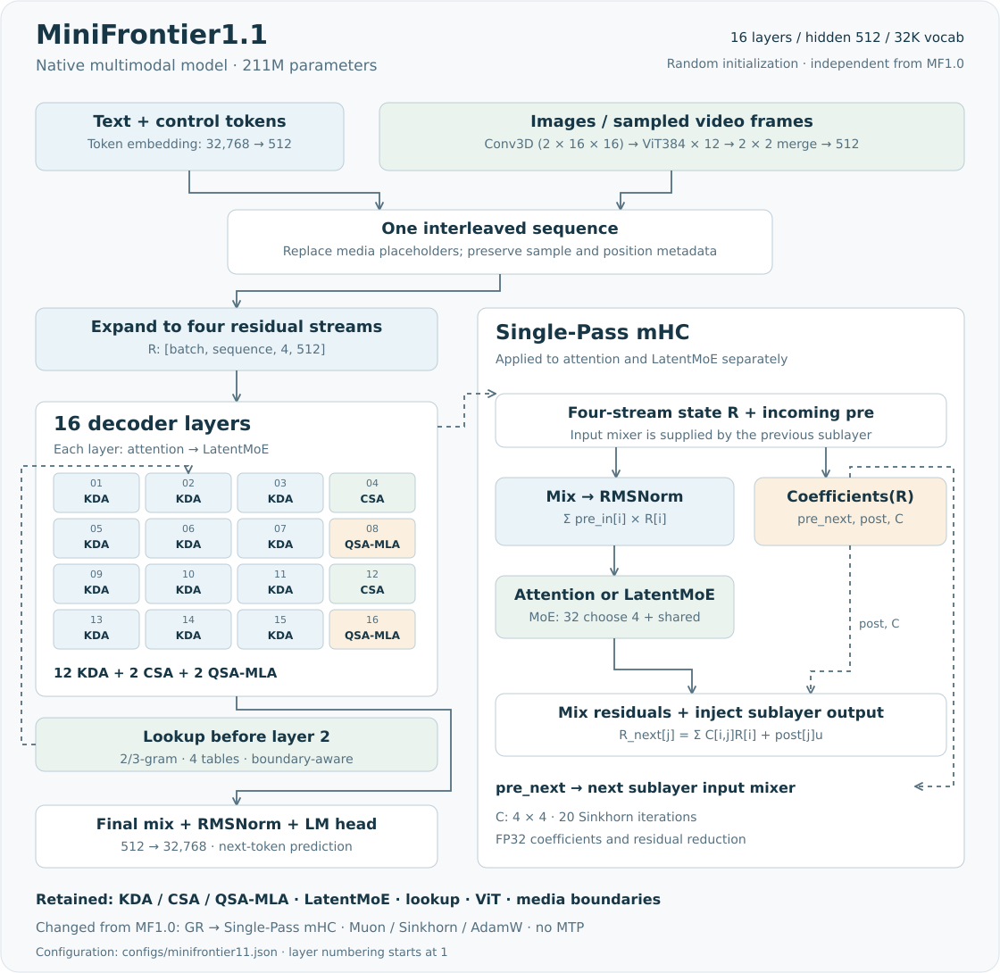

# MiniFrontier1.1

MiniFrontier1.1（MF1.1）在 [MF1.0](minifrontier1.md) 的原生多模态主干上，采用 Single-Pass mHC 替换 GR 门控残差，改用 Muon / Sinkhorn / AdamW 分组优化，并关闭主干 MTP。它保留原有注意力、专家、视觉输入和训练课程，作为独立版本从随机初始化训练。

| 研究配置 | 本仓库实现 |
|---|---|
| 参数量 | **211M**（210,859,393 个浮点参数，含视觉；无 MTP） |
| 主干 | 16 层、宽度 512、32,768 词表、四路残差 |
| 注意力 | 12 层 KDA + 2 层 CSA + 2 层 QSA-MLA |
| 专家 | 每层 32 选 4 的 LatentMoE，加全宽共享分支 |
| 输入 | 文本、图像、采样视频帧；不包含音频 |
| 状态 | 图文联合预训练已启动，尚无通过独立能力评估的聊天权重 |

[模型配置](../../configs/minifrontier11.json) · [实现代码](../../minifrontier/models/minifrontier11/modeling.py) · [训练方案](../training-strategies/2026-09-14/07-v41-mf11-implementation-and-training.md) · [阶段进度](../pretraining-plan.md)

MF1.1 的模型名称为 `minifrontier11`，配置版本为 `1.1-reference-v1`，实现位于独立的 `models/minifrontier11/`，注意力、媒体处理和缓存均为本地副本，不继承 MF1.0 模型类。MF1.0 权重及优化器状态与新结构不兼容，不能直接用于 MF1.1 恢复。

## 模型结构



[下载 SVG](../assets/minifrontier11-architecture.svg)。图按 [MF1.1 配置](../../configs/minifrontier11.json)绘制，层号从 **1** 开始。

1. 文字经词嵌入；图像和采样视频帧经 ViT 与投影，替换对应的媒体占位位置，得到统一的 `[B,T,512]` 序列。
2. 每个位置扩展为 `[4,512]` 的四路残差；第 2 层前保留 MF1 的 n-gram lookup 注入。
3. 16 个 Decoder 层分别执行一种注意力和 LatentMoE，两个子层各有独立的 Single-Pass mHC。
4. 末层传出的混合系数汇合四路状态，经 RMSNorm 和独立词表头预测下一 token。当前版本没有 MTP 辅助分支。

| 层号 | 1–4 | 5–8 | 9–12 | 13–16 |
|---|---|---|---|---|
| 注意力顺序 | KDA → KDA → KDA → CSA | KDA → KDA → KDA → QSA-MLA | KDA → KDA → KDA → CSA | KDA → KDA → KDA → QSA-MLA |

### Single-Pass mHC 的读写顺序

MF1.0 的 GR 从当前四路状态计算逐通道读门，并将子层输出直接加回各路。MF1.1 使用受约束的残差混合矩阵；每个子层产生的 `pre` 系数，供**下一个子层**读取状态使用。

```text
pre_next, post, C = coefficients(R)
h                 = RMSNorm(Σ_i pre_in[i] × R[i])
u                 = Attention(h) 或 LatentMoE(h)
R_next[j]         = Σ_i C[i,j] × R[i] + post[j] × u
```

具体顺序为：注意力读取上一层 MoE 传入的 `pre`；MoE 读取本层注意力产生的 `pre`；MoE 新产生的 `pre` 再交给下一层注意力。入口以第一路为初始读出，最后使用末层 MoE 的系数汇合状态。

系数网络将四路状态展平为 2048 维，一次线性投影得到 **24 个数**：4 个 `pre`、4 个 `post` 和 16 个混合矩阵元素。`pre` 使用 sigmoid，`post` 使用两倍 sigmoid；4×4 矩阵经 20 次 Sinkhorn 归一化，使行列和接近 1。系数与残差归约采用 FP32。该实现复用 V4.1 的计算公式，使用普通训练算子，没有引入官方部署的 Mega-mHC 融合内核。

### 保留的注意力、专家与媒体处理

| 组件 | 当前行为 | 详细说明 |
|---|---|---|
| KDA | 递推记忆、8 头 × 64 维状态和短卷积 | [三种注意力](minifrontier1.md#三种注意力如何读取历史) |
| CSA | 4-token 压缩块 + 128-token 局部窗口；稀疏阶段最多选 64 块 | [三种注意力](minifrontier1.md#三种注意力如何读取历史) |
| QSA-MLA | 根据块索引读取原始 token 的 latent KV，保留局部及媒体位置 | [三种注意力](minifrontier1.md#三种注意力如何读取历史) |
| LatentMoE | 512→256 潜在空间，32 选 4；共享分支 intermediate 768，SiTU 激活 | [专家计算](minifrontier1.md#latentmoe-路由与共享分支) |
| Lookup | 第 2 层前注入 2/3-gram 特征，4 张 32768×64 表 | [Lookup](minifrontier1.md#第-2-层前的-n-gram-lookup) |
| 视觉 | 12 层 ViT384，Conv3D patch `(2,16,16)`，2×2 空间合并 | [视觉处理](minifrontier1.md#视觉输入与位置编码) |
| 位置与边界 | 图像/视频 mRoPE、样本隔离、媒体保护和原有增量缓存 | [处理实现](../../minifrontier/models/minifrontier11/processing.py) |

MF1.1 没有引入 CED、CSA2 跨层 KV 共享或 Engram。CSA/QSA 的历史缓存仍随长度增长；配置上限 8192 不代表已通过完整 8K 质量或性能评估。视觉 token 不计入文本 CE，回答文本提供监督。

## 与 MF1.0 的版本差异

| 项目 | MF1.0 | MF1.1 |
|---|---|---|
| 总浮点参数 | 228,235,809 | 210,859,393 |
| 残差读写 | 四路 GR，逐通道读门，直接注入 | 四路 Single-Pass mHC，跨子层输入系数和受约束残差混合 |
| 最终读出 | 只读 GR | 末层系数汇合 + RMSNorm |
| 主干 MTP | 一个辅助模块，默认系数 0.1 | 无模块，系数为 0 |
| 正式优化器 | AdamW | 矩阵 Muon、嵌入/输出/lookup 表 Sinkhorn、其余 AdamW |
| 注意力 / 专家 / 视觉 | KDA、CSA、QSA-MLA、LatentMoE、原生 ViT | 保留同一结构 |
| 主 CE / 索引器预算 | 3B CE + 40M indexer input | 独立 3B CE + 40M indexer input |

MF1.1 中视觉编码与投影占 **22,934,144** 参数，mHC 占 **1,574,240**；移除 MTP 和替换 GR 共同减少了总参数量。总量包含全部专家，不表示单 token 激活计算量。

本次同时改变残差、优化器和 MTP，属于整体版本比较。即便后续出现效果差异，也不能直接归因于某一项机制。

## 训练阶段与数据复用

| 阶段 | 预算 | 注意力行为 | 优化目标 |
|---|---:|---|---|
| P0 | 200M CE | KDA 递推；CSA/QSA 稠密可见 | 文本 CE |
| P1 | 800M CE | 同上 | 文本 CE |
| Indexer | 40M input | 保持稠密教师注意力，仅索引器可训练 | 索引器蒸馏 |
| P2 | 1.4B CE | CSA/QSA 启用稀疏索引 | CE + 0.01 × 索引器损失 |
| P3 | 600M CE | 同上 | CE + 0.01 × 索引器损失 |

主 CE 合计 **3B**，Indexer 的 input 另计。MF1.1 保留 dense → indexer → sparse：当前离散 Top-K 选择不能直接从语言 CE 获得索引器梯度，不能跳过索引器训练后仍将稀疏访问视为已学习的能力。图文联合训练从 P0 开始，视觉与主干均随机初始化。

优化器按参数含义分组。可分离的 Q/K 按头使用 Muon，融合 KV 保留实际矩阵边界；词嵌入、输出头和 lookup 表使用 Sinkhorn；卷积、归一化和标量等使用 AdamW。主干峰值学习率 `3e-4`，视觉 `1e-4`，其余调度见[联合训练方案](../training-strategies/2026-09-14/07-v41-mf11-implementation-and-training.md#预训练安排)。

MF1.1 复用 MF1.0 的 tokenizer、已编码文本、像素与元数据。数据视图只允许模型版本与两个 MTP 开关字段不同，并校验原数据及新配置；它减少重复存储，不转换旧权重，也不把重复消费的语料计作新增数据。[数据复用检查](../../tests/test_mf11_data_reuse.py)

安装依赖后，可以只在 CPU 上查看版本配置和阶段安排：

```bash
CUDA_VISIBLE_DEVICES='' OMP_NUM_THREADS=2 \
  uv run minifrontier mf1 recipe --model-version 1.1
```

该命令不启动训练。训练、推理和导出入口与 MF1 共用，必须保留 `minifrontier11` 模型身份及 `1.1-reference-v1` 配置版本，见[MF1 使用指南](../guides/minifrontier1.md)。

MF1.1 的训练入口（包括微型 quickstart）当前需要 Git checkout 中的版本方案；wheel 提供模型与推理代码，不能单独运行这些训练命令。分发范围见[研究预览说明](../releases/v0.1.0.md#分发支持范围)。

## 实现验证与限制

[MF1.1 测试](../../tests/test_mf11.py)覆盖 Single-Pass 系数、混合方向和梯度、跨子层系数传递、图像/视频梯度、稠密与稀疏缓存及回滚、分段因果性、训练恢复、导出和版本拒绝；[优化器测试](../../tests/test_v41_optimizer.py)核验更新规则与状态恢复。这些检查验证实现行为，不替代真实检查点的语言、多模态和吞吐评估。

MF1.1 尚不支持旧 MTP 草稿训练入口；独立草稿模型和实际推测加速需要另行实现、训练与测量。SFT、偏好训练与工具能力也不能由模型接口存在推断为已完成。

| 阅读目标 | 代码入口 |
|---|---|
| 独立配置、Decoder 与最终读出 | [modeling.py](../../minifrontier/models/minifrontier11/modeling.py)、[configuration.py](../../minifrontier/models/minifrontier11/configuration.py) |
| Single-Pass mHC | [residual.py](../../minifrontier/models/minifrontier11/residual.py) |
| 独立训练课程与优化器 | [minifrontier1_strategy.py](../../minifrontier/training/minifrontier1_strategy.py)、[v41_optim.py](../../minifrontier/training/v41_optim.py) |
| 数据版本视图 | [minifrontier1_components.py](../../minifrontier/data/minifrontier1_components.py) |

MF1 原有组件来源见[来源映射](../../configs/minifrontier1/source-map.json)，新增 mHC 与优化器参考 DeepSeek-V4.1，许可范围见[第三方说明](../../THIRD_PARTY_NOTICES.md)。
