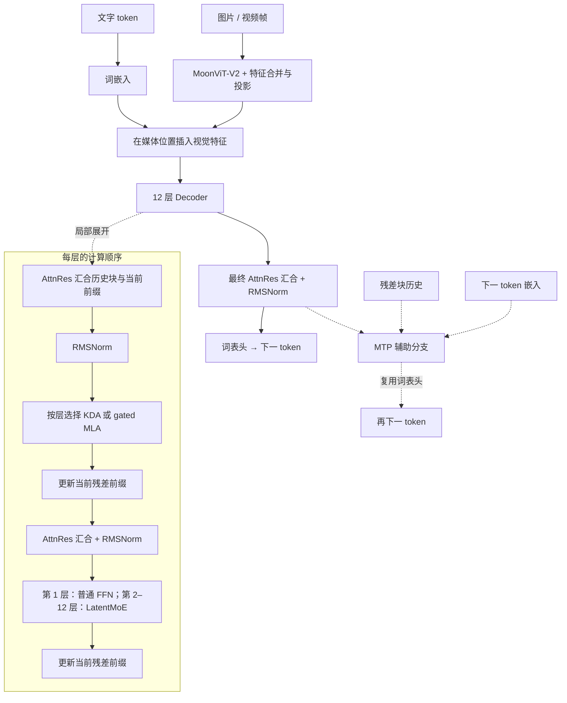
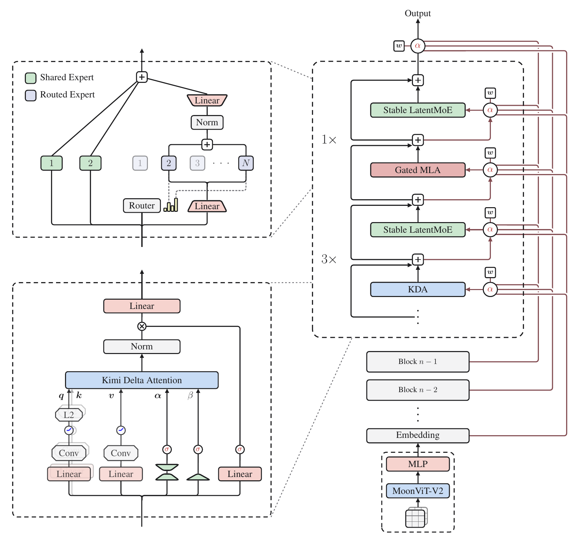

# MiniKimi-K3

MiniKimi-K3 将 Kimi K3 的混合注意力、AttnRes 和 LatentMoE 缩小到本地研究容量，图像与视频帧由 MoonViT-V2 编码。

| 研究配置 | 本仓库实现 |
|---|---|
| 参数量 | **205M**（204,526,216 个浮点参数，含视觉和 MTP） |
| 输入 | 文本、图像、采样视频帧 |
| 训练阶段 | 已启动 **K1 图文联合预训练**；[阶段进度](../pretraining-plan.md) |

模型从随机初始化开始训练，尚无通过能力验收的公开聊天权重。

[运行示例](../guides/quickstart.md) · [研究配置](../../configs/strategies/minikimik3-v2.json) · [实现代码](../../minifrontier/models/minikimik3/modeling.py) · [固定上游源码](../../third_party/upstream/kimi-k3-c5d1dd4) · [配置细节](#当前研究配置) · [验证范围](#实现验证与训练状态)

## 模型结构

[层序](#本仓库的结构与层序) · [KDA / MLA](#注意力递推层与-gated-mla-分工) · [AttnRes](#attnres沿网络深度汇合信息) · [LatentMoE](#stable-latentmoe浅层例外与两条专家路径) · [视觉 / MTP](#moonvit-v2-与-mtp) · [官方图](#官方报告结构图)

下图按本仓库研究配置绘制：主路径从文字与媒体汇合向下展开，虚线标出 Decoder 局部展开和 MTP 辅助分支。官方报告图位于本节末尾，可对照来源结构。

### 本仓库的结构与层序



层号从 1 开始。12 层中，第 **4、8、12** 层使用 gated MLA，其余 **9** 层使用 KDA。第 **1** 层使用普通 FFN，第 **2–12** 层使用 LatentMoE；AttnRes 每 4 层形成一个残差块。

### 注意力：递推层与 gated MLA 分工

**KDA（Kimi Delta Attention）** 将 Q/K/V 投影送入因果短卷积，再以门控 delta 更新维护历史状态。配置为 8 个头、每头 64 维。

**Gated MLA（Multi-head Latent Attention）** 直接读取因果可见的历史内容。查询低秩为 128，KV 潜在宽度为 64；每头 query/key 分量为 64+32 维，value 为 64 维，输出带逐元素 sigmoid 门。

固定 Kimi 实现采用 **NoPE**：虽然配置字段仍叫 `qk_rope_head_dim`，该 32 维分量并不应用旋转位置编码。潜在投影与缓存是不同层面的实现；本地缓存开销需按实际保存的张量统计。

### AttnRes：沿网络深度汇合信息

AttnRes 保留已完成的残差块，用可学习查询对历史块与当前前缀打分，经 softmax 汇合成子层输入。它沿网络深度读取表示；KDA 和 MLA 则沿 token 序列读取信息。

注意力前和 FFN 前各有一次 AttnRes 汇合与 RMSNorm，子层输出更新当前前缀。每 4 层切换残差块，最终输出也经 AttnRes 与 RMSNorm。第 1 层的注意力尚无历史块；进入该层时，输入嵌入被存入初始残差块，供后续汇合使用。

### Stable LatentMoE：浅层例外与两条专家路径

第 1 层为 `512→2048→512` 的普通 FFN。后续 11 层并行执行：

| 路径 | 计算 |
|---|---|
| 路由专家 | 在完整 512 维输入上从 32 个专家中选 2 个；特征降至 256 维，执行 intermediate 256 的专家 FFN，汇合、归一化后升回 512 维 |
| 共享专家 | 直接处理 512 维输入；2 个共享专家合并为 intermediate `2×256=512` 的共享 FFN |
| 输出 | 两条路径相加，更新残差前缀 |

专家保留来源实现的 SiTU 有界激活与路由计算；专家数量、潜在宽度及共享容量采用本项目配置。

### MoonViT-V2 与 MTP

缩小的 **MoonViT-V2** 使用 12 层、宽度 384、6 个头、patch 14、空间合并 2、时间合并 4。合并后的特征投影到 512 维，替换媒体位置的词嵌入。图像和视频帧数由本模型处理器决定；它与 MF1 的 `(2,16,16)` Conv3D 配置不同。

**MTP 是本项目的训练适配。** 固定上游发布配置的 `num_nextn_predict_layers=0`。本地 MTP 将主干状态与下一 token 嵌入分别归一化，拼接后经 `1024→512` 投影，送入独立的 MLA / LatentMoE / AttnRes 块，再复用主词表头预测后续 token。该分支同时接收残差块历史，默认辅助系数为 **0.1**。

### 官方报告结构图



图源：Moonshot AI / Kimi Team，[Kimi K3: Open Frontier Intelligence](https://github.com/MoonshotAI/Kimi-K3/blob/3cb39dfd32e51c3328e2e4b4af21341247d06c43/k3_tech_report.pdf#page=3)，Figure 2，PDF 第 3 页。图内内容保持原样，权利归原作者；[提取与来源记录](../assets/upstream/README.md)。

右侧自下而上是主干：视觉特征与词嵌入汇合，每三层 KDA 后接一层 gated MLA，AttnRes 汇合此前残差块。左侧展开注意力与专家计算。本仓库缩小了层数和专家规模，并保留首层普通 FFN，具体配置见前面的层序与模块说明。

## 当前研究配置

下表为本页结构图对应的[研究配置](../../configs/strategies/minikimik3-v2.json)。总参数量包含全部专家，每 token 只激活其中一部分；根目录兼容配置和微型示例采用其他容量。

| 项目 | 本仓库配置 | 来源与适配 |
|---|---|---|
| 主干 | 12 层、hidden 512、64K 词表、上下文上限 4096 | 保留 3 KDA : 1 MLA 层序 |
| 残差 | AttnRes，每 4 层一个块 | 保留沿深度汇合的机制 |
| FFN | 首层普通 FFN；后续 32 选 2 + 2 共享，latent 256 | 缩小专家容量，保留首层例外 |
| 视觉 | 12 层 MoonViT-V2，宽度 384 | 沿用原生媒体接入方式 |
| MTP | 1 个辅助模块，系数 0.1 | 本地训练设计 |

初始化、损失聚合、优化器与学习率由本项目配置；训练适配不包含上游完整训练栈和融合内核。

## 最小运行入口

```bash
CUDA_VISIBLE_DEVICES='' OMP_NUM_THREADS=2 MINIFRONTIER_MIN_FREE_GIB=1 \
  uv run minifrontier quickstart --model minikimik3 --device cpu \
  --output outputs/kimi-quickstart
```

先[安装依赖](../guides/quickstart.md)，每次使用新输出目录。示例为微型文本配置，不启用视觉和 MTP；CUDA KDA 另需 `training` extra 中的 FLA。

## 实现、验证与训练状态

完整主预算为 **2B CE**。后续为 SFT/QAT、9 个教师的 MOPD 蒸馏及草稿训练。阶段进度与数据依赖见[预训练计划](../pretraining-plan.md)，配方依据见[工作参数](../experiments/2026-09-10-pretraining-cutover/working-recipes.md)。

已有检查覆盖 KDA CPU/CUDA 前向与梯度、AttnRes / MLA / LatentMoE 来源对照、原生视觉、MTP、Muon、缓存和恢复，详见[实现审计](../audits/strategy-implementation-v2.md)。完整主训练、独立能力评估、正式后训练与草稿速度测量尚未完成。

## 对照源码阅读

| 阅读目标 | 代码入口 |
|---|---|
| Decoder 调度与初始化 | [modeling.py](../../minifrontier/models/minikimik3/modeling.py) |
| KDA、NoPE MLA 与 LatentMoE | [upstream_layers.py](../../minifrontier/models/minikimik3/upstream_layers.py) |
| 历史残差块汇合 | [attnres.py](../../minifrontier/models/minikimik3/attnres.py) |
| 视觉接入 | [vision.py](../../minifrontier/models/minikimik3/vision.py) |
| 本地 MTP | [mtp.py](../../minifrontier/models/minikimik3/mtp.py) |

## 使用与边界

[训练与恢复](../guides/training.md) · [后训练](../guides/posttraining-adaptation.md) · [草稿训练与推理](../guides/draft-adaptation.md) · [历史文本版本](../legacy/minikimik3-text-v1.md) · [早期失败复盘](../training-failure-v1.md)

Kimi 派生组件保留 [Kimi K3 自定义许可](../../LICENSES/LicenseRef-Kimi-K3.txt)，组件范围见[第三方说明](../../THIRD_PARTY_NOTICES.md)。
