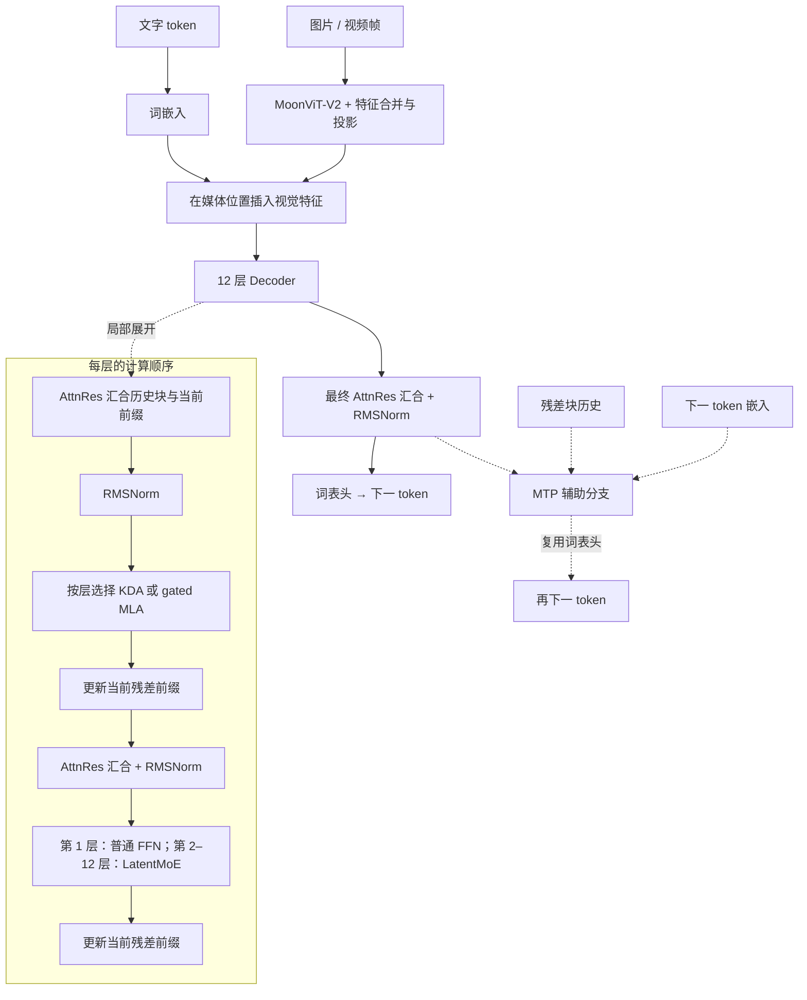

# MiniKimi-K3

**MiniKimi-K3 适合研究混合注意力、跨层信息汇合与潜在空间专家。** 它交替使用 KDA 和 gated MLA，以 AttnRes 汇合残差块，并在较窄的潜在空间执行路由专家计算；图像与视频帧通过 MoonViT-V2 接入。

这是基于固定 Kimi K3 源码缩小容量的 v0.1.0 研究预览实现，当前没有通过能力验收的公开聊天权重。固定来源与逐组件许可见[第三方说明](../../THIRD_PARTY_NOTICES.md)，[历史文本版本](../legacy/minikimik3-text-v1.md)只保留作演进记录。

[运行示例](../guides/quickstart.md) · [研究配置](../../configs/strategies/minikimik3-v2.json) · [实现代码](../../minifrontier/models/minikimik3/modeling.py) · [固定上游源码](../../third_party/upstream/kimi-k3-c5d1dd4)

## 模型结构

### 官方报告结构图


图源：[Kimi K3: Open Frontier Intelligence](https://github.com/MoonshotAI/Kimi-K3/blob/3cb39dfd32e51c3328e2e4b4af21341247d06c43/k3_tech_report.pdf#page=3)，**Figure 2，PDF 第 3 页**，Moonshot AI / Kimi Team。 原图仅裁去页内正文与空白，图内标签保持原样；版权归原作者，详见[图示来源记录](../assets/upstream/README.md)。

读图时先看右侧自下而上的主干：视觉特征与词嵌入汇合，每三层 KDA 后接一层 gated MLA，AttnRes 从此前块中汇合信息。左侧分别展开 KDA 与专家计算。图中的上游专家规模不适用于本仓库；Mini 配置及首层 FFN 例外见下文。

### 本仓库的结构与层序



图按本项目 12 层研究配置绘制，层号从 1 开始。第 **4、8、12** 层为 gated MLA，其余 **9** 层为 KDA。**第 1 层使用普通 FFN，第 2–12 层才使用 32 选 2 的路由专家和 2 个共享专家。** AttnRes 按配置的 4 层块组织历史；它在层深方向选择和汇合信息，与注意力在 token 序列上的计算不同。首层没有此前残差块可供读取。

| 核心设计 | 可以从这个模型中学习什么 |
|---|---|
| KDA，Kimi Delta Attention | 如何维护递推状态和短卷积状态，并验证 CPU 与 CUDA 路径 |
| MLA，多头潜在注意力 | 如何用低秩潜在表示组织 KV，以及保留 NoPE 内容分量与输出门 |
| AttnRes，注意力残差 | 如何学习从此前残差块与当前前缀汇合子层输入 |
| LatentMoE，潜在空间混合专家 | 如何在 256 维潜在空间做路由专家计算，再与共享专家合并 |
| MoonViT-V2 与 MTP | 如何将媒体编码接入同一序列，并加入未来 token 的辅助监督 |

### 注意力：递推层与 gated MLA 分工

KDA 层将投影后的 Q/K/V 送入短卷积与门控 delta 递推，维护每头的历史状态；MLA 层则执行因果注意力，让当前 token 直接访问历史内容。研究配置为 **8 个头、KDA 每头 64 维**；MLA 查询低秩为 **128**，KV 潜在宽度为 **64**，每头 query/key 的两个分量宽度为 **64+32**，value 为 **64**。

这里尤其需要注意 **NoPE**：固定 Kimi 实现保留名为 `qk_rope_head_dim` 的维度拆分，但不对该分量应用旋转位置编码；不能仅凭字段名把它画成 RoPE。MLA 的逐元素 sigmoid 输出门用于调节各头的结果。MLA 的潜在投影也不保证当前参考缓存已经实现官方内核的全部显存收益，应分别检查投影与缓存实现。

### AttnRes：沿网络深度汇合信息

普通残差不断把子层输出加到同一个前缀上。AttnRes 则保留已完成的残差块，并用可学习查询对历史块和当前前缀打分，经 softmax 汇合后送入子层。它选择的是**此前层的表示**，不是历史 token 的 KV；因此不会替代 KDA 或 MLA。

本项目按 4 层组成残差块。注意力前和 FFN 前各做一次 AttnRes 汇合与 RMSNorm，再执行计算并更新当前前缀；块完成后进入历史，最终输出也经过 AttnRes 与 RMSNorm。初始层尚无此前的残差块。

### Stable LatentMoE：浅层例外与两条专家路径

**第 1 层是 intermediate 2048 的普通 FFN。** 后续 11 层才启用 LatentMoE：路由在完整 512 维输入上选择 32 个专家中的 2 个；特征降至 256 维，在所选专家中执行 intermediate 256 的 FFN，汇合后归一化并升回 512 维。共享路径直接使用完整宽度输入；配置的 2 个共享专家在实现中合并为 intermediate `2×256=512` 的共享 FFN，再与路由分支相加。

因此上游概览图中的“注意力 + Stable LatentMoE”需要结合首层例外阅读，也不能将上游报告的专家总数和激活数直接沿用到 Mini 配置。SiTU 的有界激活与路由细节保留在来源模块中，具体宽度和训练目标由本项目配置。

### MoonViT-V2 与 MTP

图像和视频帧通过缩小的 MoonViT-V2：**12 层、宽度 384、6 个头、patch 14、空间合并 2、时间合并 4**。视觉特征经合并与投影变成 512 维，在媒体位置与文字嵌入汇合；patch 数和媒体 token 数要按实际处理后的网格计算。它不同于 MF1 的 `(2,16,16)` Conv3D ViT，二者预处理配置不可混用。

**这里的 MTP 是本项目训练适配**：固定发布配置的 `num_nextn_predict_layers=0`，不能将它描述成完整提取的官方 MTP 训练模块。本地实现使用主干信息与下一 token 嵌入，经归一化、拼接和 `1024→512` 投影后进入独立的 MLA／LatentMoE／AttnRes 块，复用词表头；还需要传递残差块历史。当前辅助系数为 **0.1**。研究配置包含视觉和 MTP，最小 CPU 示例为微型文本路径；草稿适应和量化部署分别有额外训练与验证要求。

| 项目 | 本仓库研究配置 | 与上游图的关系 |
|---|---|---|
| 主干 | 12 层，hidden 512，64K 词表，4096 配置上下文 | 保留 3 KDA : 1 MLA 的混合节奏，缩小容量 |
| 跨层连接 | AttnRes，4 层一个块 | 保留按深度汇合的机制 |
| FFN | 首层普通 FFN，后续 32 选 2 + 2 共享，latent 256 | 应以此处的首层例外和专家规模为准 |
| 视觉 / 辅助头 | 缩小的 MoonViT-V2 + 一个 MTP | 视觉保留来源接入方式，MTP 为本地训练设计；全部从零初始化 |
| 训练与执行 | 本地训练、缓存、损失及优化器适配 | 不代表完整复现官方训练栈或融合内核 |

## 最小运行入口

```bash
CUDA_VISIBLE_DEVICES='' MINIFRONTIER_MIN_FREE_GIB=1 \
  uv run minifrontier quickstart --model minikimik3 --device cpu \
  --output outputs/kimi-quickstart
```

需先按[安装指南](../guides/quickstart.md)安装依赖，每次使用新的输出目录。该命令使用微型文本配置，视觉与 MTP 不在示例中启用；CUDA KDA 还需要 `training` extra 中的 FLA 依赖。

## 当前研究配置

这份配置共有 **204,526,216** 个参数，包含 MoonViT 视觉编码器和 MTP。根目录的文本兼容配置与[微型示例](../guides/quickstart.md)采用不同容量。训练默认使用单卡，具体显存和速度需要结合序列长度、图像数量及批次大小测量。

## 实现、验证与训练状态

| 状态 | 范围 |
|---|---|
| 已实现 | 文本主干、原生视觉适配、MTP、对应 Muon/路由更新、增量缓存；QAT 仿真和后训练/草稿入口 |
| 已验证 | KDA CPU 参考递推与 CUDA FLA 的前向/梯度，AttnRes、MLA、LatentMoE 原始源码对照，原生视觉/MTP、路由、Muon、增量缓存及短训练/恢复。MLA 保留 NoPE 和 sigmoid 输出门。 |
| 实验 | 已完成部分小样本学习与配方比较，首阶段正式训练已启动；完成和停止记录见[实验档案](../experiments.md) |
| 待完成 | 后续预训练阶段、独立能力评估、正式后训练和草稿速度测量 |

截至 2026-09-12，已启动正式首阶段 **K1，图文联合预训练**，使用冻结词表和数据绑定。完整主预算为 **2B CE**；阶段进度与后续工作统一见[当前实验计划](../experiments/current-plan.md)，参数选择见[工作配方](../experiments/2026-09-10-pretraining-cutover/working-recipes.md)。

计划路线：图文联合预训练 → SFT/QAT → 9 个教师模型 → 采样 token 上的 MOPD 蒸馏 → Kimi 草稿模型 → 能力评估。教师训练、蒸馏和量化效果仍需后续实验验证。

公开来源未披露的初始化、学习率、损失聚合和容量比例由本项目配置；本地参考后端的速度需单独测量。

## 对照源码阅读

| 阅读目标 | 代码入口 |
|---|---|
| Decoder 调度与初始化 | [modeling.py](../../minifrontier/models/minikimik3/modeling.py) |
| KDA、NoPE MLA 与 LatentMoE | [upstream_layers.py](../../minifrontier/models/minikimik3/upstream_layers.py) |
| 历史残差块汇合 | [attnres.py](../../minifrontier/models/minikimik3/attnres.py) |
| 视觉接入 | [vision.py](../../minifrontier/models/minikimik3/vision.py) |
| 本地 MTP | [mtp.py](../../minifrontier/models/minikimik3/mtp.py) |

## 使用与边界

[最小示例](../guides/quickstart.md)覆盖离线数据、PT、暂停恢复、SFT、验证和 CLI 生成；[通用训练指南](../guides/training.md)说明策略门槛和阶段迁移。[原生视觉/MTP与方案审计](../audits/strategy-implementation-v2.md)、[后训练适应](../guides/posttraining-adaptation.md)、[草稿适应](../guides/draft-adaptation.md)记录更细的实现与测试范围。

尚无通过能力评估的公开聊天权重；学习诊断和损失下降不代表已具备对话能力。早期文本训练失败见[复盘](../training-failure-v1.md)。

Kimi 派生组件保留 [Kimi K3 自定义许可](../../LICENSES/LicenseRef-Kimi-K3.txt)。
