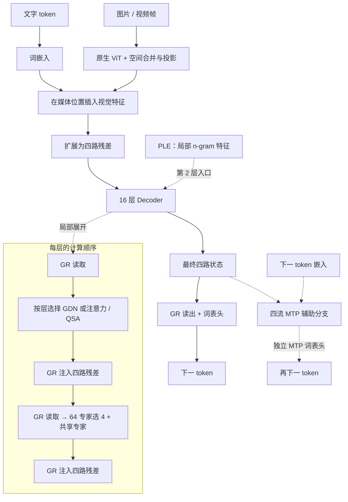
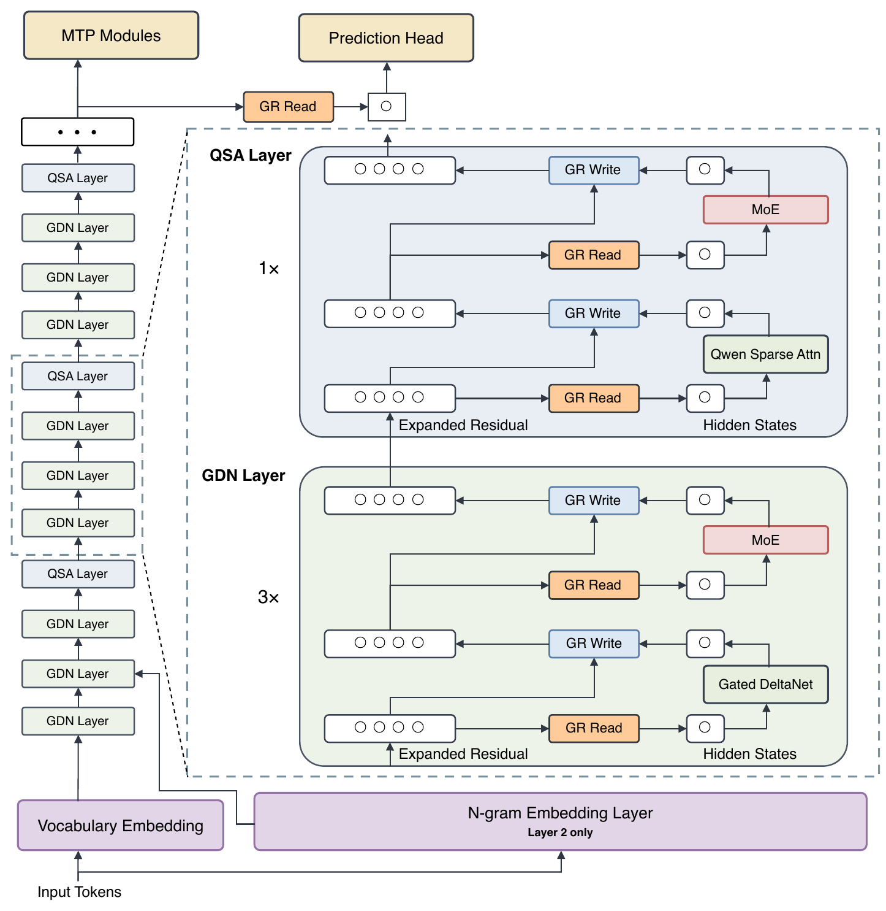

# MiniQwen4

MiniQwen4 采用 GDN / QSA 混合注意力、四路 GR、浅层 PLE 和 MoE，并接入原生视觉与 MTP。名称沿用固定来源的 `qwen4_exp` 目录，对应报告发布名称为 **Qwen3.8-Flash-Next**。

| 研究配置 | 本仓库实现 |
|---|---|
| 参数量 | **513M**（513,405,536 个浮点参数，含视觉和 MTP） |
| 输入 | 文本、图像、采样视频帧 |
| 训练阶段 | 已启动 **Q1 稠密图文预训练**；[阶段进度](../pretraining-plan.md) |

模型从随机初始化开始训练，尚无通过能力验收的公开聊天权重。

[运行示例](../guides/quickstart.md) · [研究配置](../../configs/strategies/miniqwen4-v2.json) · [实现代码](../../minifrontier/models/miniqwen4/modeling.py) · [固定上游源码](../../third_party/upstream/qwen4_exp-4177486) · [配置细节](#当前研究配置) · [验证范围](#实现验证与训练状态)

## 模型结构

[层序](#本仓库的结构与层序) · [GDN / QSA](#gdn-与-qsa不同的历史读取方式) · [GR](#gr四路残差的读写) · [PLE / MoE](#ple-与-moe不同位置的容量) · [视觉 / MTP](#视觉接入与四流-mtp) · [官方图](#官方报告结构图)

下图按本仓库研究配置绘制：主路径从文字与媒体汇合向下展开，虚线标出 Decoder 局部展开和 MTP 辅助分支。官方报告图位于本节末尾，可对照来源结构。

### 本仓库的结构与层序



层号从 1 开始。16 层中，第 **4、8、12、16** 层使用注意力，其余 **12** 层使用 GDN；注意力层随训练阶段切换稠密或 QSA 路径。PLE 仅在第 **2** 层的注意力计算前注入。

### GDN 与 QSA：不同的历史读取方式

**GDN（Gated DeltaNet）** 通过宽度 4 的因果短卷积处理 Q/K/V，再用门控 delta 更新累积历史状态。配置为 **4 个 key 头、12 个 value 头，头宽均为 64**。

**注意力 / QSA** 使用 **8 个 query 头、2 个 KV 头**，头宽 64，以 GQA 共享 KV，输出带 sigmoid 门；每头 16 维应用 RoPE。索引器另有 4 个 query 头、1 个 key 头，索引头宽 32。

QSA 将可见 key 按 4-token 块评分，再读取所选块内的**原始 token KV**。`indexer_budget=512` 对应最多 **128 个完整块**，另保留不足 4-token 的末尾部分；没有采用 MF1 的局部窗口与媒体保护集合。索引器通过蒸馏学习稠密注意力的块分布。

| 阶段 | 第 4/8/12/16 层 | 参数更新 |
|---|---|---|
| `dense_pretrain` | 稠密因果注意力 | 主干及启用的辅助模块 |
| `dense_distill` | 稠密教师提供索引监督 | 仅索引器 |
| `sparse_cpt` | 索引选择原始 KV | 主干及索引器辅助目标 |

### GR：四路残差的读写

每个 512 维 token 在 Decoder 入口扩展为四路状态。每个注意力或 MoE 子层先从 GR 读出 512 维输入，再按四个写门将更新加回残差；最终输出只做读取。

读门逐通道作用于分组 RMSNorm 后的状态，四路门控结果取均值；写门逐流作用于更新。低秩读门为 **2048→128→2048**，MF1 的同源实现将中间秩缩为 64。GR 保留原残差并直接写回，区别于 DeepSeek mHC 的 4×4 残差混合。

### PLE 与 MoE：不同位置的容量

**PLE** 在第 2 层补充 n-gram 特征。2-gram 和 3-gram 各有两个 hash 头，表大小取 32768 附近的不同素数，总行数按 128 对齐。`ple_embed_dim=512` 是四头拼接后的总宽度，每头为 **128** 维。查表结果经 key/value 投影、门控，以及核宽 4、dilation 3 的逐通道因果卷积后注入残差。

**MoE** 则在每层按隐藏表示分配 FFN 计算：64 个路由专家选 Top-4，另有一个共享专家。两条路径均直接处理 512 维输入，intermediate 为 **192**，不经过 Kimi/MF1 的 latent 256 降维。

### 视觉接入与四流 MTP

视觉编码器为 **12 层 ViT、宽度 384、6 个头**。Conv3D patch 为 `(2,16,16)`，经 2×2 空间合并后投影到 512 维，替换媒体位置的词嵌入。

一个 MTP 模块接收最终四流状态与下一 token 嵌入，经 GR、注意力和专家计算预测后续 token，默认辅助系数为 **0.1**。其输出头 `mtp.shared_head.head` **独立于主 `lm_head`**；`shared_head` 的名称不表示与主头绑权。草稿训练及接受/拒绝采样见[草稿指南](../guides/draft-adaptation.md)。

### 官方报告结构图



图源：Qwen Team，[On the Design of Qwen3.8-Next Architecture: Evaluation, Efficiency, and Training Stability](https://github.com/QwenLM/Qwen3.8-Flash-Next/blob/69885871a64393807d988b27b1b5e380e8f28526/tech_report.pdf#page=2)，Figure 1，PDF 第 2 页。图内内容保持原样，权利归原作者；[提取与来源记录](../assets/upstream/README.md)。

原图从词嵌入开始，展示浅层查表、3 GDN : 1 QSA 层序、GR 读写和 MTP。前面的本地结构图补出视觉输入。报告中的主机预取、索引复用和内核优化不属于本地性能结论。

## 当前研究配置

下表为本页结构图对应的[研究配置](../../configs/strategies/miniqwen4-v2.json)。总参数量包含全部专家，每 token 只激活其中一部分；根目录文本兼容配置和微型示例采用其他容量。

| 项目 | 本仓库配置 | 来源与适配 |
|---|---|---|
| 主干 | 16 层、hidden 512、64K 词表、上下文上限 4096 | 保留 3 GDN : 1 注意力层序 |
| 残差 / 查表 | GR 四流、低秩 128，第 2 层 PLE | 保留计算结构，缩小容量 |
| 专家 | 64 选 4 + 1 共享，intermediate 192 | 全宽 FFN |
| 索引 | 4-token 块，token budget 512 | 采用本地稀疏预算 |
| 视觉 / MTP | 缩小的 ViT + 四流 MTP | 固定来源组件的训练适配 |

初始化、损失聚合、优化器与学习率由本项目配置；训练适配不包含上游完整训练栈和融合内核。

## 最小运行入口

```bash
CUDA_VISIBLE_DEVICES='' OMP_NUM_THREADS=2 MINIFRONTIER_MIN_FREE_GIB=1 \
  uv run minifrontier quickstart --model miniqwen4 --device cpu \
  --output outputs/qwen-quickstart
```

先[安装依赖](../guides/quickstart.md)，每次使用新输出目录。示例为微型文本配置，不启用视觉和 MTP。

## 实现、验证与训练状态

完整主预算为 **3B CE**。后续包括索引器蒸馏、稀疏继续预训练、SFT/GRPO 和四流草稿模型。阶段进度见[预训练计划](../pretraining-plan.md)，配方依据见[工作参数](../experiments/2026-09-10-pretraining-cutover/working-recipes.md)。Qwen 没有配置原生 MX QAT 课程。

已有检查覆盖固定 Transformers 文本栈的同权重前向与梯度、PLE / GDN / QSA、语义分块 Muon、原生视觉、MTP、缓存与草稿回滚，详见[实现审计](../audits/strategy-implementation-v2.md)。完整主训练、独立能力评估、正式后训练与草稿速度测量尚未完成。

## 对照源码阅读

| 阅读目标 | 代码入口 |
|---|---|
| 阶段、视觉汇合与独立主输出头 | [modeling.py](../../minifrontier/models/miniqwen4/modeling.py) |
| GDN 与 GR | [upstream_core.py](../../minifrontier/models/miniqwen4/upstream_core.py) |
| Decoder、MoE 与 QSA 索引 | [upstream_decoder.py](../../minifrontier/models/miniqwen4/upstream_decoder.py) |
| PLE 查表、投影与卷积 | [upstream_ple.py](../../minifrontier/models/miniqwen4/upstream_ple.py) |
| 视觉接入 | [vision.py](../../minifrontier/models/miniqwen4/vision.py) |
| 四流 MTP 与独立辅助输出头 | [mtp.py](../../minifrontier/models/miniqwen4/mtp.py) |

## 使用与边界

[训练与恢复](../guides/training.md) · [后训练](../guides/posttraining-adaptation.md) · [草稿训练与推理](../guides/draft-adaptation.md) · [历史文本版本](../legacy/miniqwen4-text-v1.md) · [早期失败复盘](../training-failure-v1.md)

本实现使用固定 Transformers/vLLM 的 Apache-2.0 源码。独立发布的 Qwen 权重适用其自身许可，组件范围见[第三方说明](../../THIRD_PARTY_NOTICES.md)。
