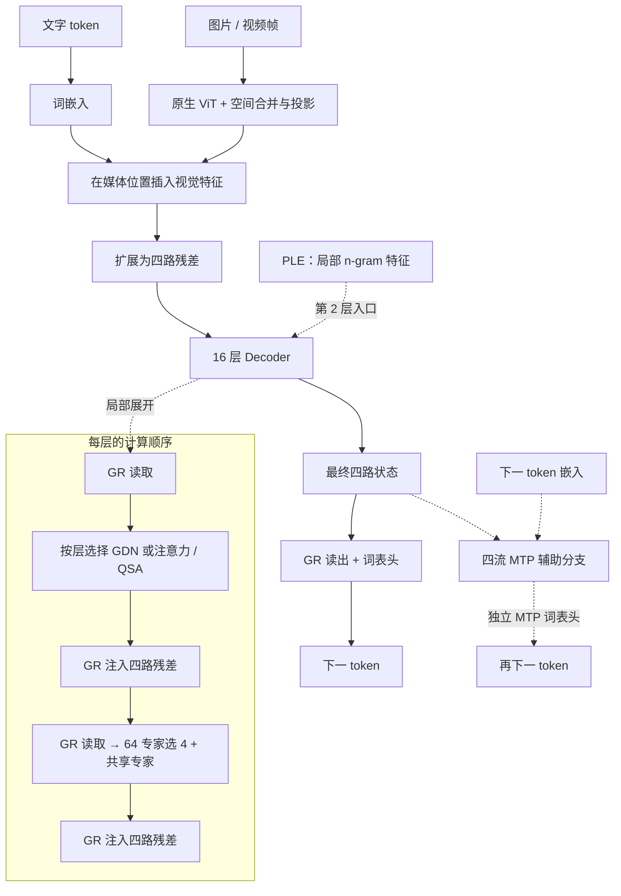

# MiniQwen4

**MiniQwen4 适合研究“递推注意力 + 稀疏检索 + 多路残差”的组合。** 它保留固定 Qwen `qwen4_exp` 源码中的 GDN、GR、PLE、MoE 和 QSA 计算结构，将容量缩小到可开展本地实验的规模，再接入原生视觉与 MTP。

这是独立的 v0.1.0 研究预览实现，不是官方 Qwen 模型的已训练小尺寸版本；当前没有通过能力验收的公开聊天权重。固定来源与逐组件许可见[第三方说明](../../THIRD_PARTY_NOTICES.md)，[历史文本版本](../legacy/miniqwen4-text-v1.md)只保留作演进记录。

[运行示例](../guides/quickstart.md) · [研究配置](../../configs/strategies/miniqwen4-v2.json) · [实现代码](../../minifrontier/models/miniqwen4/modeling.py) · [固定上游源码](../../third_party/upstream/qwen4_exp-4177486)

## 模型结构

### 官方报告结构图


图源：[On the Design of Qwen3.8-Next Architecture: Evaluation, Efficiency, and Training Stability](https://github.com/QwenLM/Qwen3.8-Flash-Next/blob/69885871a64393807d988b27b1b5e380e8f28526/tech_report.pdf#page=2)，**Figure 1，PDF 第 2 页**，Qwen Team。 原图仅裁去页内正文与空白，图内标签保持原样；版权归原作者，详见[图示来源记录](../assets/upstream/README.md)。

本仓库的名称 MiniQwen4 沿用固定来源代码目录 `qwen4_exp`；此处官方报告使用发布名称 **Qwen3.8-Flash-Next**。图从词嵌入开始，展示第 2 层查表、3 GDN : 1 QSA 的层序、GR 子层读写及 MTP。视觉接入在下方本仓库图中补出；官方预取、索引复用及内核性能不代表本地训练适配已达到相同效果。

### 本仓库的结构与层序



图按本项目 16 层研究配置绘制，层号从 1 开始。第 **4、8、12、16** 层是注意力层，其余 **12** 层为 GDN；注意力层使用稠密或 QSA 稀疏路径，由训练阶段决定。PLE 在第 **2** 层进入注意力计算之前注入，不是每层都有。

| 核心设计 | 可以从这个模型中学习什么 |
|---|---|
| GDN，Gated DeltaNet | 如何用门控递推状态处理序列，并与注意力层交替 |
| QSA，索引稀疏注意力 | 如何先训练稠密路径，再训练索引器和稀疏读取 |
| GR，门控残差 | 如何从四路状态读出子层输入，再按门值写回更新 |
| PLE，局部查表特征 | 如何把 n-gram 特征注入浅层，并维护增量状态 |
| MoE，混合专家 | 如何将每个 token 分发给 64 个路由专家中的 4 个，并合并共享专家输出 |
| 原生视觉与 MTP | 如何将视觉特征接入文本序列，并加入未来 token 的辅助监督 |

### GDN 与 QSA：不同的历史读取方式

**GDN（Gated DeltaNet）** 通过因果短卷积处理 Q/K/V，再用门控 delta 更新累积历史状态，避免每层都读取完整历史 KV。本项目配置 **4 个 key 头、12 个 value 头，头宽均为 64**，短卷积宽度为 4。这里的头数与注意力层的 8 个 query 头不同，不能用同一个“8 heads”概括全部层。

**注意力／QSA 层** 使用 8 个 query 头和 2 个 KV 头，头宽 64，以 GQA 共享 KV，并在输出使用 sigmoid 门；旋转位置编码作用于每头的 25% 维度，即 16 维。QSA 的索引器另有 4 个查询头和 1 个 key 头，索引头宽 32。它先将可见 key 每 4 个组成一个块，用块分数选择位置，再让主注意力读取所选块中的**原始 token KV**。

配置的 `indexer_budget=512` 对应最多 **128 个完整块**，另保留不足 4-token 的末尾部分。它不是 MF1 的“Top-64 块 + 128 局部窗口 + 媒体保护”集合；两个模型采用不同的稀疏预算和媒体接入规则。索引器蒸馏用于让块选择接近稠密注意力的目标分布，离散 Top-K 本身不能直接承担全部端到端学习。

| 阶段 | 第 4/8/12/16 层如何读历史 | 参数更新 |
|---|---|---|
| `dense_pretrain` | 稠密因果注意力 | 训练主干及启用的辅助模块 |
| `dense_distill` | 稠密教师注意力提供索引监督 | 冻结其余参数，只训练索引器 |
| `sparse_cpt` | 按 QSA 索引选择原始 KV | 主干继续训练，并使用索引器辅助目标 |

### GR：四路残差的读写

进入 Decoder 后，每个 512 维 token 扩展为四路状态。每个注意力或 MoE 子层先用 GR 读出一个 512 维输入，计算完成后再将同一个更新按四个写门分配回残差流。读门逐通道作用于分组 RMSNorm 后的状态，写门逐流作用于更新；最终输出只做 GR 读取。

研究配置的低秩读门为 **2048→128→2048**。这一读写结构与 MF1 相同来源，但 MF1 将中间秩缩为 64。GR 不执行 DeepSeek mHC 的 4×4 残差混合矩阵，也不维护 Kimi AttnRes 的历史块列表。

### PLE 与 MoE：不同位置的容量

PLE（n-gram 查表特征）只在第 **2** 层入口启用。配置涵盖 2/3-gram、每个阶数两个 hash，表大小从 32768 附近的不同素数选取，合并存储后的总行数按 128 对齐。`ple_embed_dim=512` 是四个查表头拼接后的总宽度，即每头 **128** 维；查表结果经过 key/value 投影、门控和核宽 4、dilation 3 的逐通道因果卷积后注入残差。因此 lookup 表是该模型参数量的重要部分。官方图中的主机内存预取属于上游执行设计，本项目图不据此宣称已实现同等卸载收益。

每个 Decoder 层使用 **64 个路由专家中的 Top-4**，另有一个共享专家。它们直接处理 512 维输入，路由和共享 FFN 的 intermediate 均为 **192**；没有 Kimi/MF1 的路由分支先降至 latent 256 再升维的步骤。PLE 提供局部词组特征，MoE 根据当前隐藏表示分配 FFN 计算，两者不是同一种路由。

### 视觉接入与四流 MTP

本项目原生视觉适配使用 **12 层 ViT、宽度 384、6 个头**，Conv3D patch 为 `(2,16,16)`，2×2 空间合并后投影为 512 维，再替换媒体位置的文字嵌入。官方 Figure 1 主要展示语言主干，图中未画出的视觉分支在下方 Mini 图中单独补出。

一个 MTP 模块接收最终四流状态和下一 token 嵌入，维持 GR 读写与注意力／专家结构；默认辅助系数 **0.1**。当前 Qwen 适配使用**独立 MTP 词表头** `mtp.shared_head.head`，与主 `lm_head` 不绑权；命名中的 `shared_head` 不表示它复用了主头参数，这一点与 MF1、Kimi 和 DeepSeek 适配不同。官方图中的索引复用与推测解码描述不能直接作为 Mini 草稿速度证据，草稿训练和回滚验证见[草稿适应指南](../guides/draft-adaptation.md)。

| 项目 | 本仓库研究配置 | 与官方报告的关系 |
|---|---|---|
| 主干 | 16 层，hidden 512，64K 词表，4096 配置上下文 | 保留 3 GDN : 1 注意力的节奏 |
| 残差 / 查表 | GR 四流、低秩 128，第 2 层 PLE | 保留对应计算结构，采用 Mini 容量 |
| 专家 | 64 选 4 + 一个共享，intermediate 192 | 全宽专家，不是 LatentMoE |
| 稀疏索引 | 4-token 块，token budget 512 | 预算按本地配置，不沿用报告长上下文数字 |
| 视觉 / MTP | 缩小的原生 ViT + 四流 MTP | 由固定来源组件进行本地训练适配，随机初始化 |

## 最小运行入口

```bash
CUDA_VISIBLE_DEVICES='' MINIFRONTIER_MIN_FREE_GIB=1 \
  uv run minifrontier quickstart --model miniqwen4 --device cpu \
  --output outputs/qwen-quickstart
```

需先按[安装指南](../guides/quickstart.md)安装依赖，每次使用新的输出目录。该命令使用微型文本配置验证训练、恢复与生成；下表描述更大的研究配置，视觉与 MTP 不在这个最小示例中启用。

## 当前研究配置

这份配置共有 **513,405,536** 个参数，包含视觉编码器和 MTP。根目录的文本兼容配置与[微型示例](../guides/quickstart.md)采用不同容量。训练默认使用单卡，具体显存和速度需要结合序列长度、图像数量及批次大小测量。

## 实现、验证与训练状态

| 状态 | 范围 |
|---|---|
| 已实现 | 文本主干、原生视觉适配、四流 MTP、Muon/路由更新、增量缓存，以及后训练和草稿模型入口 |
| 已验证 | 固定 Transformers 文本整栈同权重前向/梯度、PLE/GDN/QSA、语义分块 Muon、原生视觉和 MTP；GDN/PLE/KV/QSA 增量状态及草稿回滚、阶段冻结和恢复。 |
| 实验 | 已完成部分小样本学习与配方比较，首阶段正式训练已启动；完成和停止记录见[实验档案](../experiments.md) |
| 待完成 | 后续预训练阶段、独立能力评估、正式后训练和草稿速度测量 |

截至 2026-09-12，已启动正式首阶段 **Q1，稠密注意力预训练**，使用冻结词表和数据绑定。完整主预算为 **3B CE**；阶段进度与后续工作统一见[当前实验计划](../experiments/current-plan.md)，参数选择见[工作配方](../experiments/2026-09-10-pretraining-cutover/working-recipes.md)。

计划路线：稠密注意力预训练 → 索引器蒸馏 → 稀疏注意力继续预训练 → SFT/GRPO → 四流 MTP 草稿模型 → 能力评估。当前没有为 Qwen 声明原生 MX QAT 训练配方。

公开来源未披露的初始化、学习率、损失聚合和容量比例由本项目配置；本地参考后端的速度需单独测量。

## 对照源码阅读

| 阅读目标 | 代码入口 |
|---|---|
| 阶段、视觉汇合与独立主输出头 | [modeling.py](../../minifrontier/models/miniqwen4/modeling.py) |
| GDN 与 GR | [upstream_core.py](../../minifrontier/models/miniqwen4/upstream_core.py) |
| Decoder、MoE 与 QSA 索引 | [upstream_decoder.py](../../minifrontier/models/miniqwen4/upstream_decoder.py) |
| PLE 查表、投影与卷积 | [upstream_ple.py](../../minifrontier/models/miniqwen4/upstream_ple.py) |
| 视觉接入 | [vision.py](../../minifrontier/models/miniqwen4/vision.py) |
| 四流 MTP 与独立辅助输出头 | [mtp.py](../../minifrontier/models/miniqwen4/mtp.py) |

## 使用与边界

[最小示例](../guides/quickstart.md)覆盖离线数据、PT、暂停恢复、SFT、验证和 CLI 生成；[通用训练指南](../guides/training.md)说明策略门槛和阶段迁移。[原生视觉/MTP与方案审计](../audits/strategy-implementation-v2.md)、[后训练适应](../guides/posttraining-adaptation.md)、[草稿适应](../guides/draft-adaptation.md)记录更细的实现与测试范围。

尚无通过能力评估的公开聊天权重；学习诊断和损失下降不代表已具备对话能力。早期文本训练失败见[复盘](../training-failure-v1.md)。

采用固定 Transformers/vLLM 的 Apache-2.0 源码；独立发布的 Qwen 权重按其自身许可使用。
